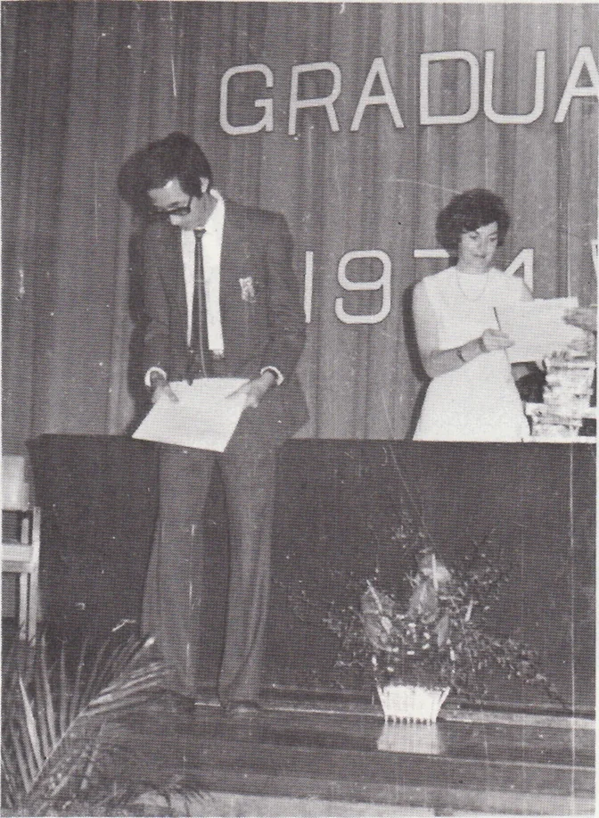
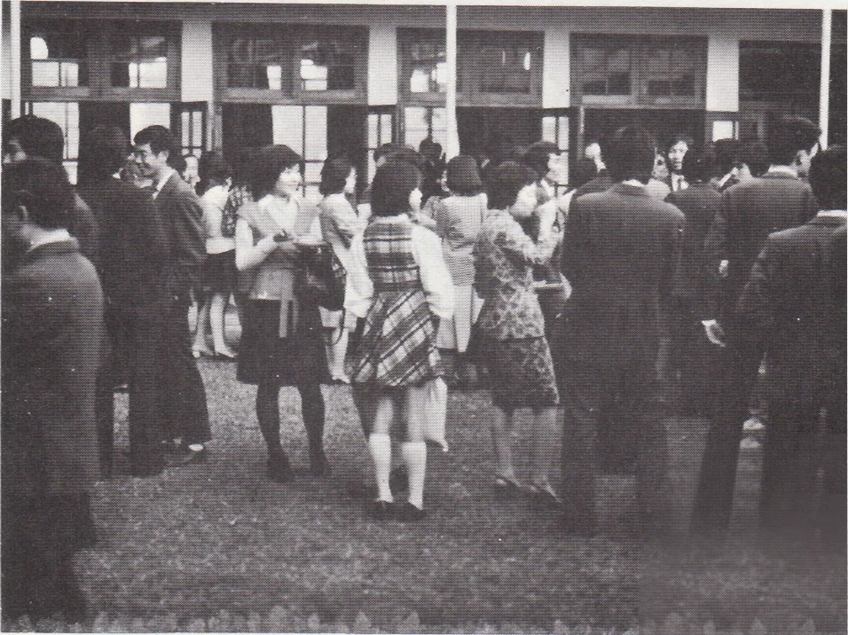
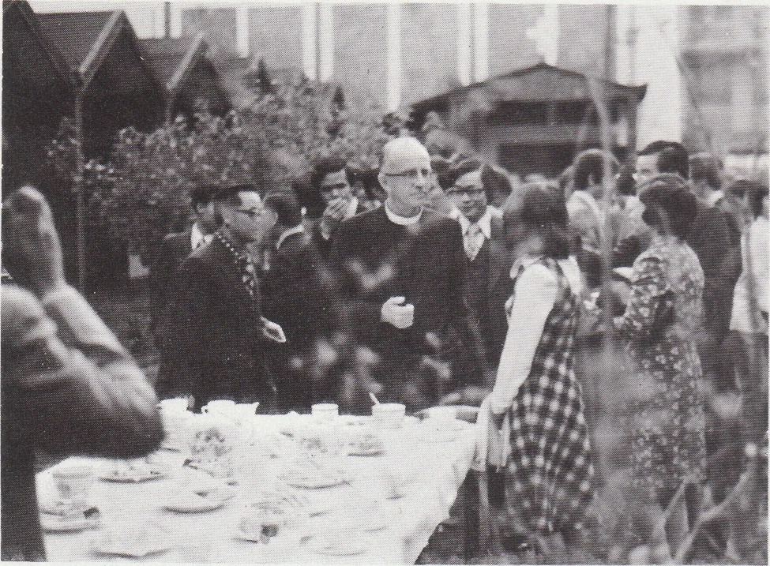

# Wah Yan Star 1976 - Page 16

## Extracted Photos & Figures





## Page Text Content

```text
Speech Day
GRADUA
lo every graduate, the Speech Day is
really a great event. On 20th Nov.， 1975，
the Speech Day 75 was held. We had the
great honour to have Professor N.A.
Brimer, Head of Education Department
H.K.U. address the school and Nrs.
Brimer to present certificates and prizes
to the graduates.
The guests of Honour were welcomed
by NIr. Yu, our Assistant Principal and
later Rev. Fr. Barrett, S.J, our Principal，
addressed the guests. He mentioned that
the existing education system in Hong
Kong is dangerous in the sense of specia-
lization. He also pointed out to the
parents and guests that Wah Yan did
try to give a complete education to all
students before they sit for the School
Certifcate Examination.
Professor Brimer gave our graduates
a clearer look at the teaching of English
in his speech after the presentation of
certificate and prizes by Mrs. Brimer.
A vote of thanks was prosposed by
our Head Prefect and following that was
the performance by the School Choir. The
ceremony ended with the School Song and
graduates were invited to dinner held by
the Past Students' Association in the
school hall.
```
