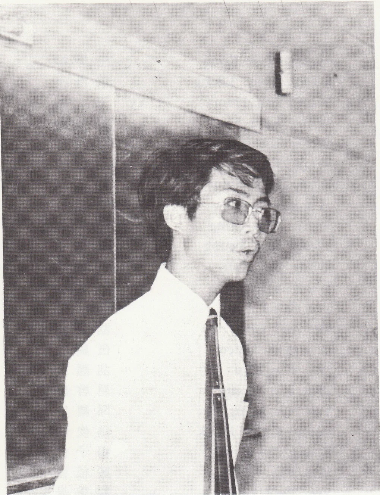
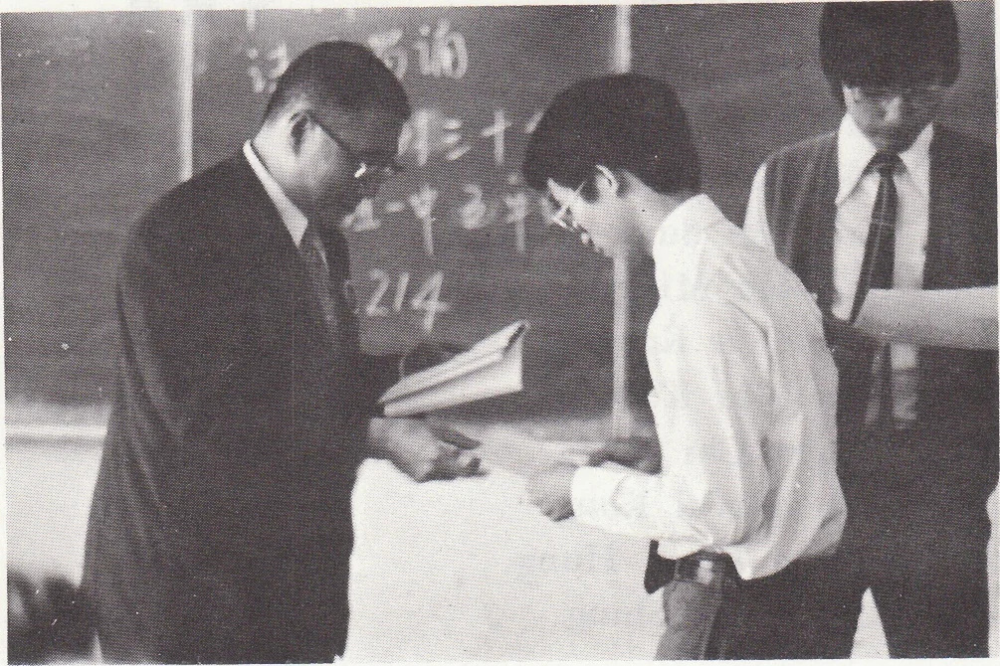
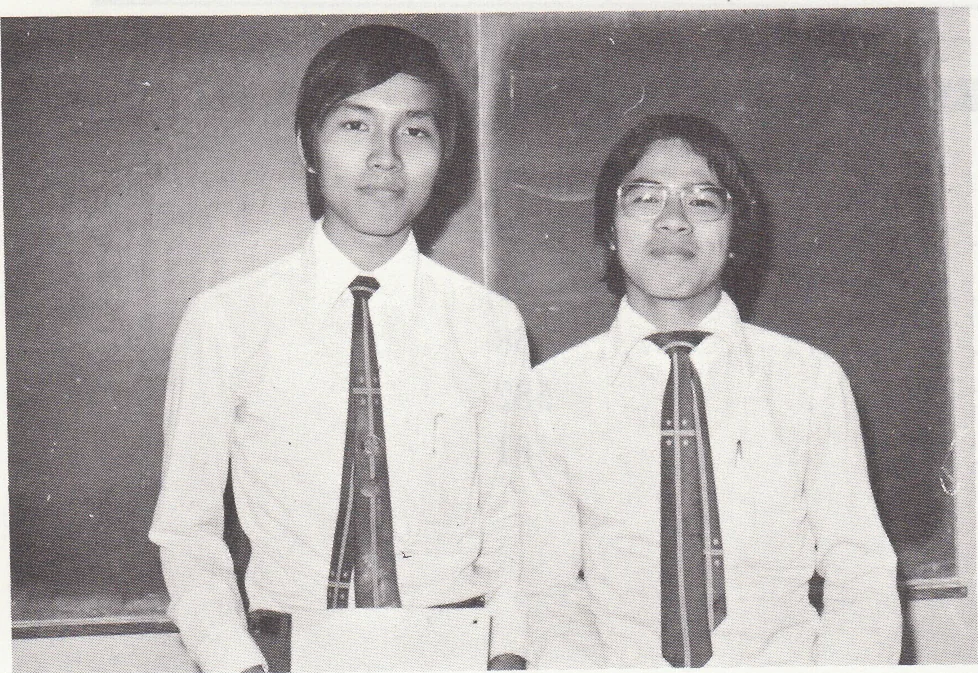

# Wah Yan Star 1976 - Page 22

## Extracted Photos & Figures





## Page Text Content

```text
中文朗誦
在十一月舉行的第二十七屆校際朗誦節中
，參加學校達數百間，而比賽者則數以千計，
比賽者往往是由學校所選出的精英，在此「高
手雲集」的比賽中，奪得季軍已經不易，成爲
冠軍更是困難。而本校卻奪得四項冠軍，五項
亞軍，十一項季軍，成績的優異，自不待言，
而最難得的，就是本校再度奪得了那萬人渴望
的「華僑日報盃」。（註：這次是本校一連五
屆奪得此盃。前四屆的盟主分別是鄧榮甡，朱
谷士、何德禧和江達峯。）
在中一詩詞獨誦的比賽中，冠軍由本校的
郭淳浩同學以一首別天掉奪得。郭同學獨誦時
用一種圓潤而高吭的聲調，音調間充份流露出
天真自然的氣質，博得台下一片掌聲，終於以
高分取勝。
中五的潘仲豪同學亦以獨誦短歌行一詩揄
元。潘同學對作者曹操當時的心境變化和矛盾
與及他的獨有氣質掌握透徹，得到評判老師的
激賞，終以優良成績奪得冠軍。
中六的比賽中，詩詞獨誦及散文獨誦分別
由我校的麥志輝同學和林青鋒同學奪得錦標。
在詩詞獨誦中，麥同學的抑揚頓挫與詞境相配
合，充份表達出詞的獨特韻味，而其雄壯及婉
約的聲調，更能發揮了陳亮的水調歌頭和陳興
義的臨江仙的意境。
散文獨誦的林青鋒同學，以一篇節錄自論
語的待坐章成爲冠軍，奪得「華僑日報盃」。
林同學對於情感的表達十分成功，而對於孔子
及其四個弟子的不同性格更能充份掌握，表達
得淋漓盡致，固而得到評判激烈讚賞，奪得冠
軍，成爲「華僑日報盃」盟主。
在各項比賽中，我校奪得亞軍和季軍的亦
大不乏人，他們亦各有優點，爲着篇幅所限，
不便贅叙。
```
