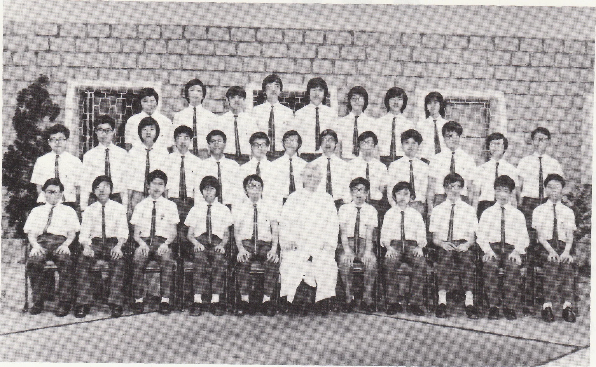

# Wah Yan Star 1976 - Page 24

## Extracted Photos & Figures



## Page Text Content

```text
Speech Festival
◎
This year we entered for quite a great variety of items. Three boys ggot first. One
of them, who competed in the Prose Reading Class, ggot a trophy in the final. Besides，
there were altogether 4 second places, 8 third places
and all the entrants got certifcates.
This was the first year we had ever entered for the Bible Reading Class and
yet the results
were unexpectedly encouraging.
Results：—
Form
Name
Wu Pui Tak
Anson Chan
Lee Tong Loy
Andrew Peng Chi On
（Winner of the Longman
Pau Wing Nin
Chow Pak Fai
Mak Wing Yeung
Lam Ngok Sam
Lai Shiu Leung
Tang Lok Sang
Leung Kun Yu
Wong Tak Kin
Chow Tak Cheong
Class entered
Open Solo-verse Speaking
Verse Speaking
Verse Speaking
Prose Reading
Challenge Trophy）
Prose Reading
Scripture Reading
Verse Speaking
Prose Reading
Scripture Reading
Non-open Verse Speaking
Prose Reading
Verse Speaking
Prose Reading
Verse Speaking
Public Speaking
Position
```
