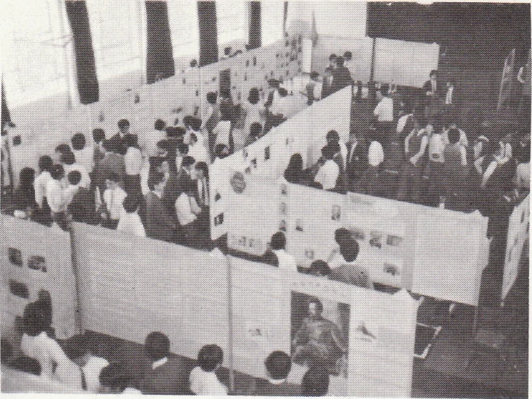
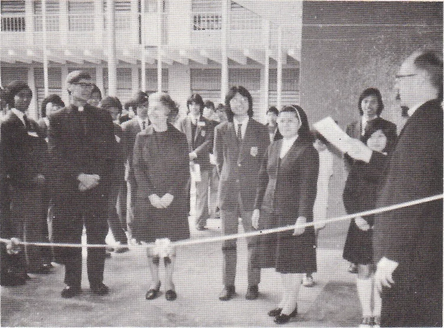
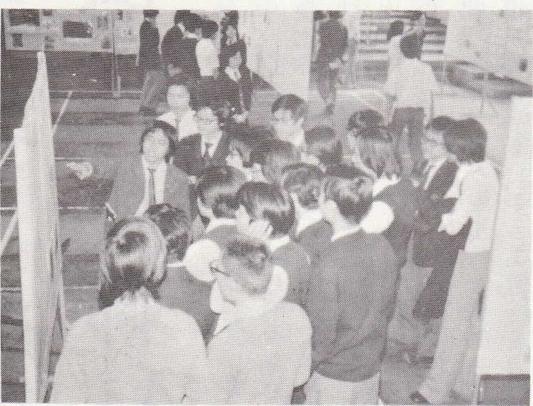
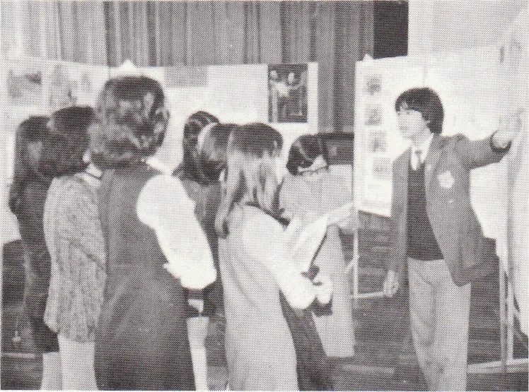
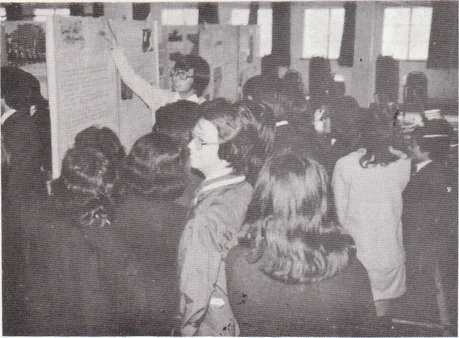

# Wah Yan Star 1976 - Page 32

## Extracted Photos & Figures







## Page Text Content

```text
The
Joint School
History
Exhibition
Inside the School Hall
*In the mid-1930s
Exhibition
MSS
Exhibition in SPC
The opening ceremony
This year the History Club of our school in-
vited
the History
Societies
Naryknoll Sisters'
School and St. Paul's Convent School to join in
organising an exhbition at the end of Narch.
The
theme was ‘Communist
Revolutions in China and
Russia'（中國與蘇聯之共產革命）•
The preparation work started in December and
we went to
librarles to look tor tie necessary
I1la-
terials. By inviting Dr. Li Ngok to give us a talk，
we.got a more Cear impression of the history of
China after 1949. Since past exhibitions were criti-
cized as being too verbose, we therefore found as
many photos as possible for illustration.
Tlanks
mnust also be
C4國航容公司 giveu toheChira
Aviation Agency
for lending us some of their pre-
CIOuS photos.
After three months hard work, we
finally managed to finish our preparation work.
On a fne Sunday morning, the opening
cere-
mony was pertormed by the principals of the taree
particlpatng schools. Ine exhlbrtion lasted tor tree
days in our school, from 28th to 30th March.
It was
encouraging to see that a tremendous number of
visitors came and questions were raised
and some
even took down notes.
When the exhibition ended
in our school, we decided to continue it in St.Paul's
Convent School and Naryknoll Sisters'School for
four days more.
In those two schools, it was also
well-attended.
We were delighted that the exhibition was a
success and the number of visitors estimated
2,500. We must say that we were inexperienced but
through this project we Learnt and benehted a lot.
Here, we would like to offer our thanks to Mrs. Lee.
Rev. Fr. McGaley, S.J. and the School, for their
encouragement and invaluable help throughout the
exhibition.
Also to all the demonstrators and those
who sacrifced their time and effort, we wound like
to thank them for their enthusiasm and devotion.
```
