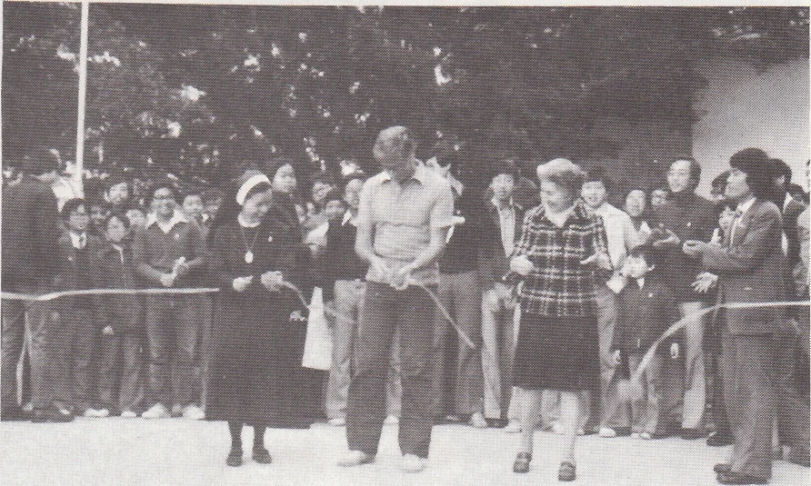
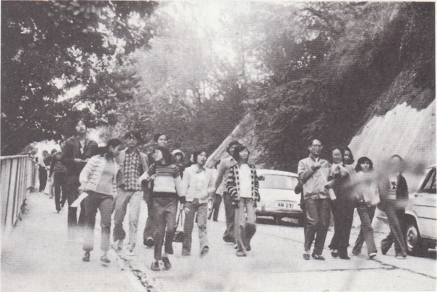
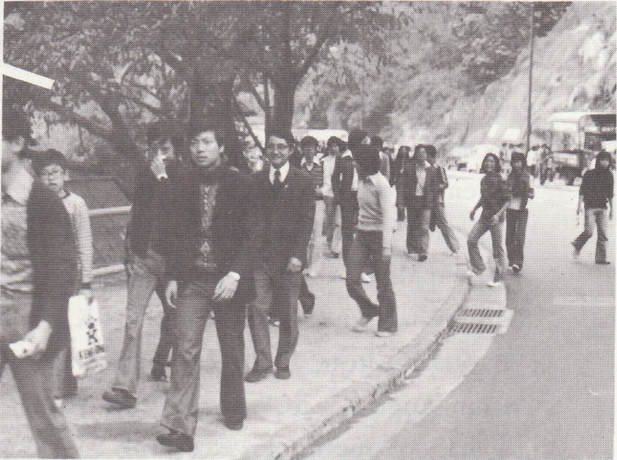
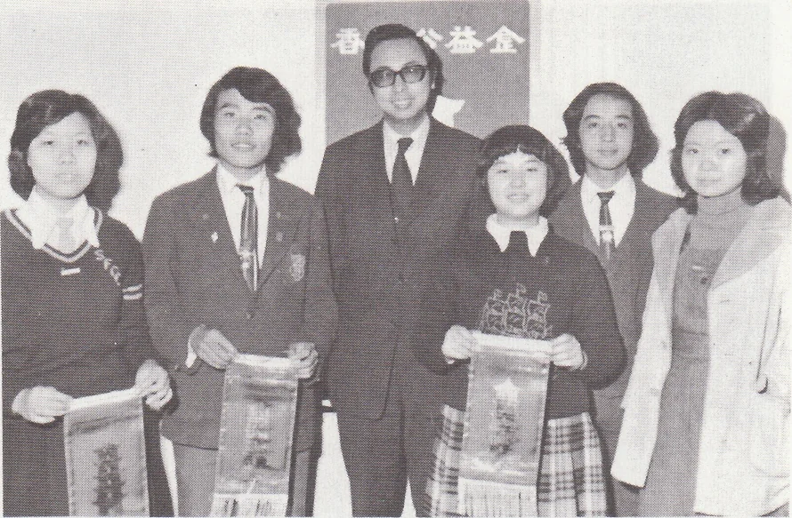

# Wah Yan Star 1976 - Page 35

## Extracted Photos & Figures






## Page Text Content

```text
Joint School
Walk For
A Million 276
On 2Ist .February, 1976, some 700
students from Maryknoll Sisters’School，
St. Francis Canossian College and ours
gathered at the entrance of our school，
waiting for the offcial start by the princi-
pals of the 3 schools. With the 3 princi-
pals leading the walk, the walkers began
their journey down the avenue. Besides
student walkers, there were some Fathers，
Sisters and teachers from the 3 schools.
Refreshments were served at each check.
point. The last walkers finished their
journey at 3 p.m. Most of the walkers
completed the 14 miles journey. The total
amount collected was about $50,000.
Thanks were given to those who took part
in the walk and the walkers who helped
to make this walk a success.
益金
Route：
W.Y.C. H.K. - Kennedy Rd. - Wanchai-
Gap Rd. - Bowen Rd. - Blue Pool's Rd.
（M.S.S.） - Wongneichung
Gap Rd.-
Black's Link - Coombe Rd. - Peak Rd.
- Barker Rd. - Findlay Rd. - Mt. Austin
Rd. （Playground） - Old Peak Rd. -
Bowen Path - Bowen Rd. - S.F.C.C.
```
