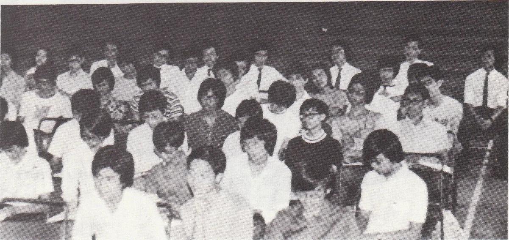
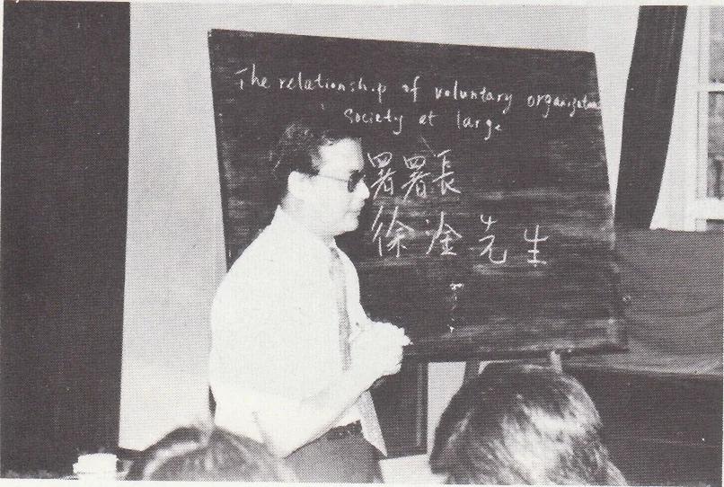
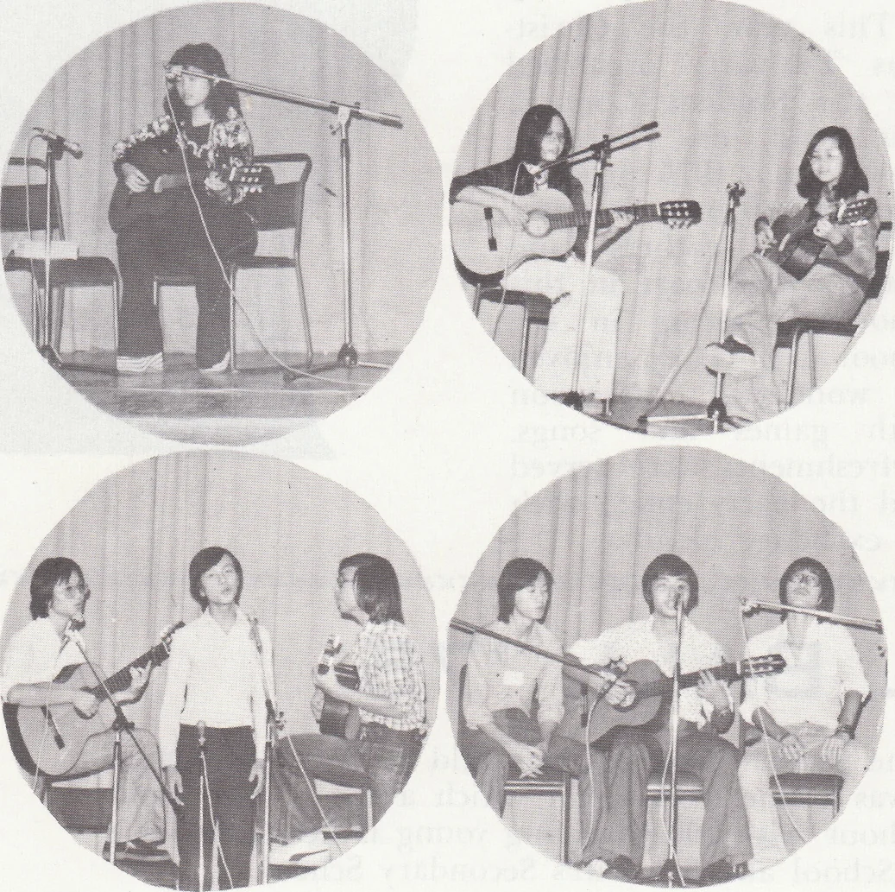

# Wah Yan Star 1976 - Page 39

## Extracted Photos & Figures





## Page Text Content

```text
LEADERSHIP TRAINING CLASS
The relatinshit •f wluntary ongagt
Secedy et larg-
暑署長
徐全先生
A Leadership Training Class was jointly organized by the Student Council and the
Community & Youth Office （Wanchai）， S.W.D.during the last summer holidays. It aim-
ed at developing in the participants a sense of awareness of their future responsibilities
and thus, improving the school activities, It was the frst time we had such a function
and a total number of sixty students from various cubs participated in it.
The class began on 9th July 1975 and lasted for nearly a month. Lectures on
topics concerning leadership were given by lecturers invited by
both the organizing
committee and C.Y.O. In every lecture, the participants joined with the organizers in
the work （e.gg. presenting the souvenirs and giving votes of thanks）. After the lecture
“How to lead a group discussion"a seminar together with a gathering were held as
a practice on the topic.
Students from Sacred Heart Canossian College and Maryknoll
Sister's School were invited to join the seminar. A camp and a hike were included
in the programme at first, but due to insuficient equipment, they were cancelled.
Inally,over 45 partcpants completed the Class and each ot them receved
crtllcate n the closing ceremony
KK&&UUUUUUUUUUUUUUUUU 以B 以 以以以以以 B 以E 以以以EEE以 以E以以以以E以B以E以以SEyy以以 以K以KEEKKr
first concert of the term: Fall Rhythn
The concert organised by the
Let's Get Together
Club took
place in the evening of 26th
October at our school hall. Per-
formers from nine schools came
and special guests were also invit-
ed. When the concert started，
crowds of people focked into the
hall which could hardly accomod-
ate them all. As a result, many
people had to stand throughout the
concert. The appreciation of every
item of the concert by the audien-
ce was clearly shown by their en-
thusiastic applause and cheers.
```
