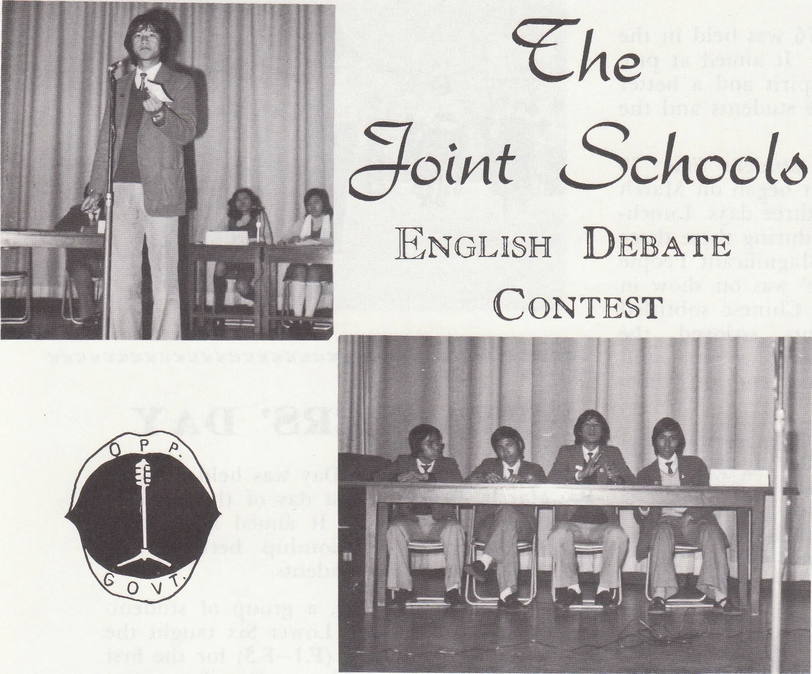
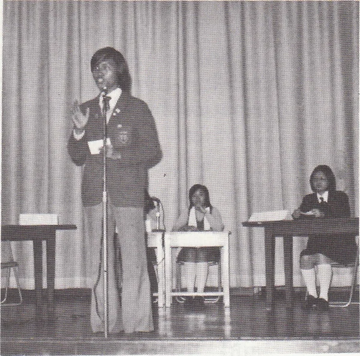

# Wah Yan Star 1976 - Page 42

## Extracted Photos & Figures




## Page Text Content

```text
Ehe
Joint Schooo
ENGLISH DEBATE
CONTEST
OPE
The defeat in the friendly debates with Maryknoll Sisters' School and St. Paul's
Secondary School did not prevent us from participating in the Joint Schools English De-
bate. Though the debating team of this year was not as strong as that of last year, we
did by our best to get a brilliant result. The debaters were Josiah Chok, Cheung Yuk
Tong, Paul Tan （he left us in January）， Stephen Lam, Francis Poon and Tang Hee Wah.
By drawing lots, our first opponent was Shaukiwan Govt. School. The motion was
that 'Survival is the ultimate goal of human beings."
Our school was on the negative
side. Although we had prepared for this debate, it was not held for our opponents
withdrew. We then came to the 2nd round without any bloodshed.
Our next opponent to tackle was Chan Sui Ki （La Salle） College. The motion
was “The child is the father of the man". Our School stood for the opposition. Our
US.
the debate by a score of 2-1.
Having been promoted to the quarter-final, we were not very confident of ourselves
because last year, our school had been knocked out in this round.
Nevertheless, we had
the ambition of getting promotion to the semi-final. Luck seemed to play tricks with
us because we were very vulnerable.
The motion was ‘War is essential to human pro-
gress”and we were the govt. side. This time, our opponent was Sacred Heart Canossian
College. Though we had tried our best, we could
not convince the adjudicators with
our arguments.
We lost by 1-2 and were knocked out. Although we were defeated, we
did learn a lot from the debates. At least, we would not be afraid of speaking publidy
any more.
The final of the contest was held on 28th March at St. Joseph's College between
D.G.S. & S.H.C.C. After an hour of debate, D.G.S.got the championship.
```
