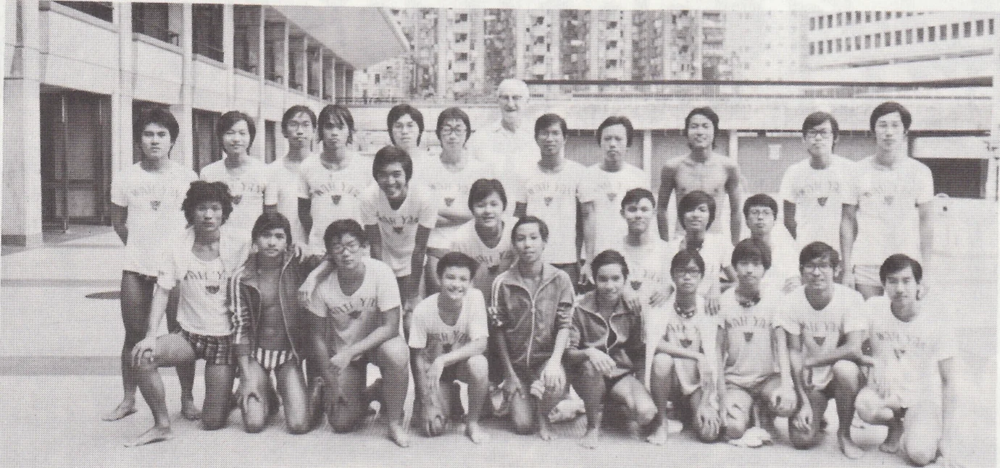

# Wah Yan Star 1976 - Page 47

## Extracted Photos & Figures



## Page Text Content

```text
［U〇
Life Guard Club
Patron
：Rev. Fr. Corbally S.J.
Chairman
：Yiu Hi Cheong （L6A）
Vice-chairman: Leung Shing Keung
Activities：
In August, a 2-day camp was organised for the members at Tai Long Sai Wan.
About 15 members took part in this camp.
In September, as usual, the service in the Swimming Gala was handled and a
life-saving demonstration was performed by our members as a regular programme.
Earlier than usual, a new committee was elected in October to co-ordinate the
activities of the Royal Life Saving Society, Hong Kong Branch. On the same month，
our members entered the Inter-school Lifesaving Gala. The results were good, especi.
ally the C Grade boys who got 3rd in C Grade.
A film was shown on the stage giving further information of life-saving techni-
ques in December.
A canoe Camp was held on 19th April in Stanley Bay. 27 members joined the
camp
and were doing well in canoeing.
In the summer vacation, duties are to be handled in swimming pools and
beaches.
Last year, we had gained a number of awards：
（1） Teacher Certificate ..
（2） Bronze medallion
（3） Ist Bar in Bronze Medallion
（4） Advanced Artifcial Resuscitation
（5） Artifcial Resuscitation Instructor
```
