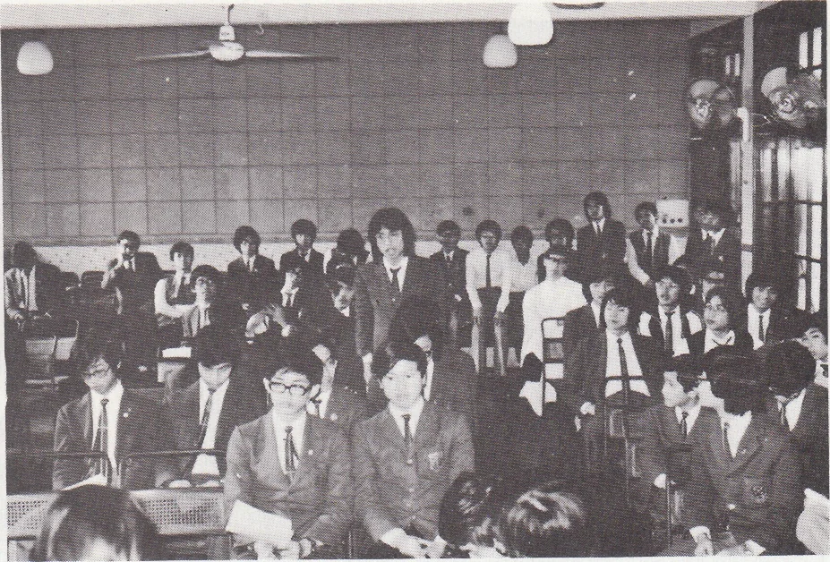
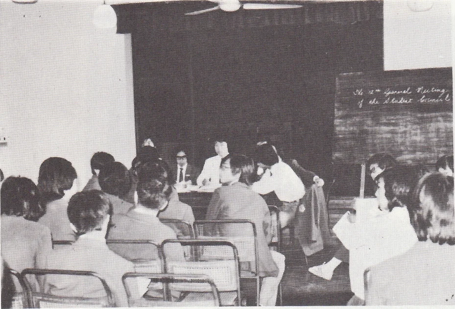

# Wah Yan Star 1976 - Page 53

## Extracted Photos & Figures




## Page Text Content

```text
1975, December 6：
The Annual Ball was held. The gir ls' schools invited were Maryknoll Sisters'
School St. Paul's Convent School and St. Paul's Secondary School.
1975, December：
Files, book-marks and brief-cases were made for the students.
1975，
December：
The interclass X'mas Decoration Competition was held.
1975, December 19：
The X'mas Celebration was held. In the morning there was a variety show in
the Hall and then in the afternoon, a game of football was played.
1975，
December 23：
The Christmas Tea Party was organised for the junior boys （F.I-F.3）.
1976，
March 16-April 3：
The Student Fete （Festival） was launched. This included the Interhouse Games
Competition, lunch-time concerts, film-shows and a Chinese concert.
1976，
March 19：
The Teachers' Day was held.
1976，
March：
Sport-T-shirts were made for the students.
1976, July-August：
Training classes will be jointly organised by all the clubs and the Student
Council.
1976, July 15：
An open air concert will be jointly organised by the Let’s Get Together Club
and the Student Council.
1976，
July：
The Leadership Training Course will be taken place from mid-July to early-
August.
1976，
August：
In early August, there will be a gathering for the F.1 boys who have been newly
admitted to Wah Yan.
```
