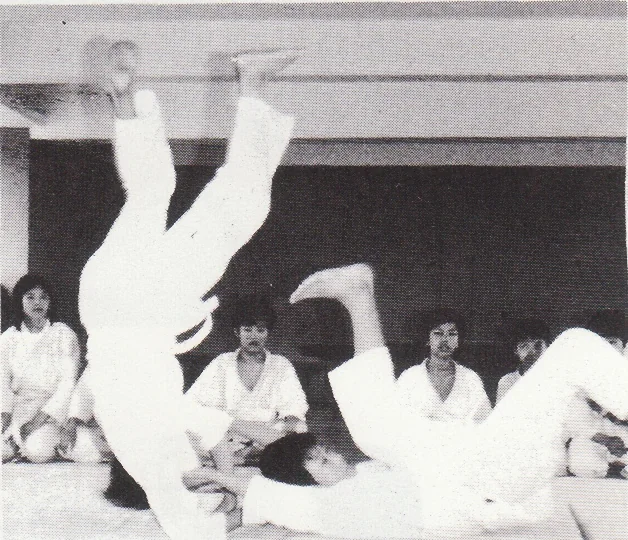
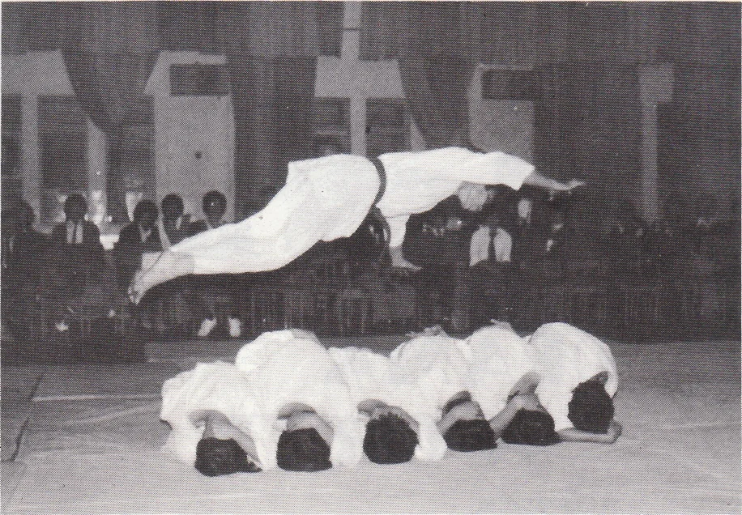
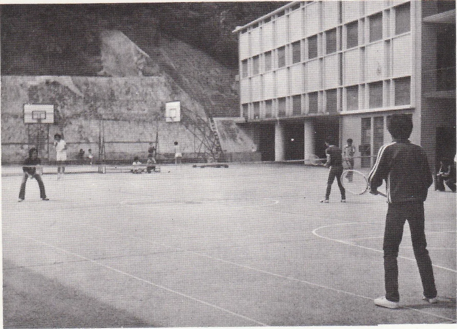

# Wah Yan Star 1976 - Page 62

## Extracted Photos & Figures





## Page Text Content

```text
MAN
K
H
Jado Club
Adviser
：Fr. M. Corbally, S.J.
Chairman
：Fung King Tak （1.4l）
Vice-chairman: Jackie Tang （3A）
Coach
：Nr. Koon Fuk Cheug
NU09
Our club has been making a lot of progress since last year.
The number of members has been greatly increased. Two flm
shows about Judo were held in the hall. Examinations for
the promotion of belts were held twice this year. Luckily，
three of our members were promoted to orange belts and this
strengthened our team a lot. We invited the Judo team of
St. Peter's Secondary School and St. Paul's College to have
friendly matches with us. A picnic was held and the destina-
tion was Sir Cecil's Ride. All the participants enjoyed the
picnic very much.
On 27th of Feb.， we were invited to participate in a Kung
Fu performance organised by St. Joseph's College. Our per-
formance was very successful. That was due to the hard prac
tice of the members.
In the second term this year we
started a new training course. Although
it was much harder, the morale was con-
tinuously increasing because all members
knew the wonderful result of hard prac-
tice. We were going to participate in an
Inter-school Judo Competition organised
by the Judo Club of H.K.U. during the
summer holiday. We would try our best
to raise the standard and to promote the
spirit of Judo.
Jennis Cluk
Adviser
：Rev. Fr. Farren, S.J.
Chairman
：Chu Tak Kwong （L6A）
Vice-chairman: Thomas Lam （L6A）
Total Membership: 45
Activities：
1. Regular practice twice a week with
Fr. Farren and Mr. Alfred Lee as
coaches.
2. An open-tournament for both mem-
bers and non-members in March.
3. Two tournaments for members in
May and July.
4. A training course for beginners dur-
ing the Summer vacation.
```
