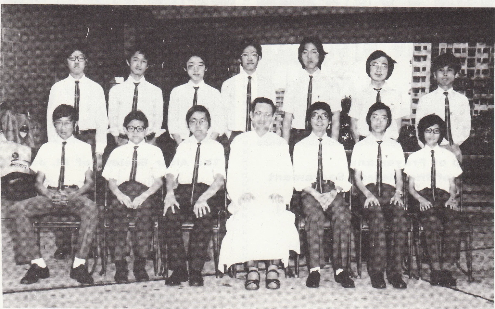

# Wah Yan Star 1976 - Page 70

## Extracted Photos & Figures



## Page Text Content

```text
Christian Life Community （Junior）
Ecclesiastical Assistant: Rev. Fr. Brosnan S. J
Prefect
No. of members
：Anthony Lam Ngok Sum （4A）
：15
Neetings were leld after school every
Friday and conducted by the ecclesiastical
assistant. Spiritual guidance was given at
the meetings. We attendedl a special
Nass in the school chapel on every
Nonday.
Activities：
1 - Many
members joined the 3-day
camp which was organised yearly by
the Hong Kong Federation of
Christian Life Communities. It was
held during the summer holidays.
2 - The annual Caritas Bazaar was held
in late October at St. Paul's Convent
School as usual. We ran the Wah
Yan stall and a sum of more than
$8,000 was raised.
3 - The ninth General Assembly of the
Federation of the C.L.C. was held
during the Christmas holidays in the
Diocesan Youth Centre. We had two
representatives participating in this
3-day conference.
4 - We went
carolling on Christmas
Eve and raised about $101 for the
Duchess of Kent Children's Ortho-
paedic Hospital.
5 - There were five members taking part
in the aunual Day Rally held on 28th
March in the Catholic Centre.
6 - There was Rosary service, organised
by our C.L.C.， in the school chapel
in October at lunch time every day.
7- We had our general reception on
26th April in the school chapel.
There were seven new members this
year.
```
