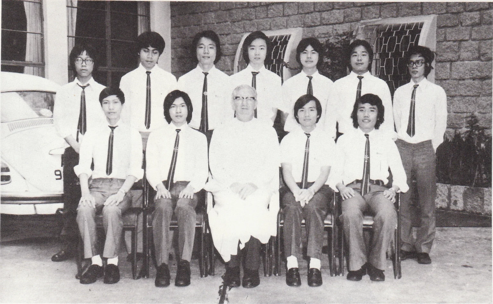

# Wah Yan Star 1976 - Page 71

## Extracted Photos & Figures



## Page Text Content

```text
Christian Life Community（Senior）
Ecclesiastical Assistant : Rev. Fr. Farren, S.J.
Prefect
： Thomas Chui （L6S）
We had our general meeting biweek ly on Mondays after school.
1. The annual Caritas Bazaar was held on 2nd Nov.， 1975. As usual, the stall
was run by our community with the assistance of the Altar Society and
A.O.P.. Together with the raffle tickets, a sum of $10,000 was raised.
2. A reception took place on 8th Dec.， 1975. 10 members were received.
3. Six of our
members attended the General Assembly in December, 1975.
4. The Day Rally was held on 28th Mar, 1976. The theme was “Poor with
Christ for a better service". A visit was paid to a squatter area and follow-
ed by a discussion and mass.
5. Two of our members attended a seminar organised by the Federation. The
topic was “The Church in Hong Kong”.
6. A retreat would be held in July.
7. Visits to other C.L.Cs would be made in the summer vacation.
8. In this summer, the World Assembly would be held in Manila. The theme
was“Poor with Christ for a better service -the role of C.L.C.in the mission of the
church today"
```
