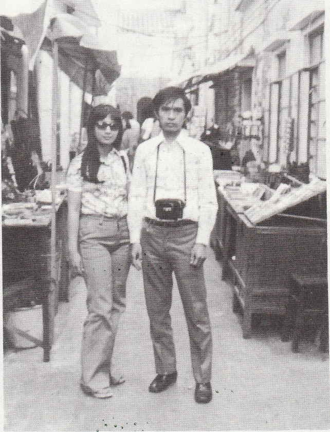

# Wah Yan Star 1976 - Page 74

## Extracted Photos & Figures



## Page Text Content

```text
Sarlier Past
from the California Institute of Tech-
tancy. He obtained his degree in Univer-
nology,Pasadena, Calif. 91125：
sity of Toronto and joined a large firm
Dr. Anthony T.W.Cheung（Wah
Yan 1963）is a member of this outstand-
ing University. He lectures and has been
very successful in his research having
77777777
of accountants. He has found that there
are 25 boys of his last class in Wah Yan
now working in Toronto. Six old Wah
Yan boys are accountants in that city.
publishes more than 20 MSS in the past
From the Hung brothers and Francis
5 years. Another old Wal Yan Graduate
Tsui, now in a university in Halifax，
（1952） in the same University is Dr.
Canada：
Sunny Chan, Professor of Physics-Chemis-
try. He was then known as Chan Cheong
7777
I am glad that a lot of our friends in
Hong Kong are still writing to us often.
Him.
They are really nice guys.
They usually
Henry N. Yung in 1967 first went to
give us a lot of news about Hong Kong
Wales then to Canada. In 1974 he gra-
We miss them a lot. By the way, how
duated Bachelor of Fine Arts from Sir
about the Catholic Societies in Wah Yan？
George Williams University. He is now
Are they doing well this year？
employed at Central Art Service, Mon-
Dominic Ching 5B in '73 and Tse
treal. He is ready to be of service to any
Lai Kee 5B in '74 are both in Bus Adam
Wah Yan boys going to Montreal.
in the U.of Texas, Arlington.
Bernard Miu Leung Shan, U6A-L967，
Benjamin So Man Bong F.4 in '73 is
is now with Union Carbide Asia Ltd.，
now in U.B.G.in Science.
Sales Planning
Division. In the examina-
tion of the Institute of Chartered Secre-
Michael Tsang Keen Sang, F.4 in '74
taries and Administrators, Bernard secur-
2Z
has entered U.B.C. also.
ed an honour for Hong Kong by winning
Michael Ying Kong Tong, who left
the Sir Ernest Clarke prize for the best
Wah Yan in 1962, is now studying en-
paper in Industrial Law. 5,700 students
ggineer in Baltimore, Maryland.
He is
from 30 countries took part in the ex-
married and has a daughter of three.
amination.
Antony T.Y. Wu U6-1974, has com-
pleted the Foundation Course in Accoun-
tancy at Teeside polytechnic. He. was
placed first in the group and in each in-
dividual paper was considerably above
the average of the group as a whole. This
is what the head of his department at
Teeside said when offering.his conpatida-
tions “on your exceptionally good
per-
formance in the final examination.”
Leung Kang Chi F.4 1975, has done
a hard year's work in a highschool in
Ledyard Conn, U.S.A.
Henry Lo Hau Yee， （1966） is now
working in Toronto in a frm of accoun-
tants. He frst did Pharmacy and was in
research. Grants for research were slow in
coming through so switched to accoun-
Terence Yuen Wai Keung 1962 is
now a dentist in Adelaide Aus-
tralia.
```
