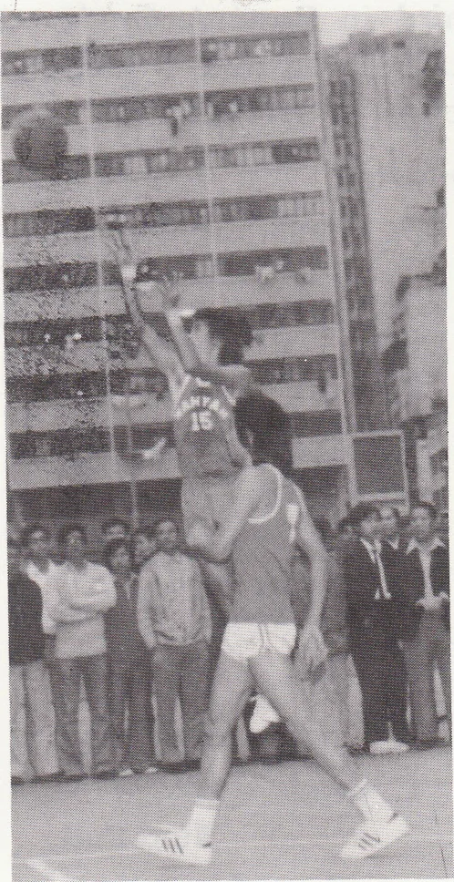
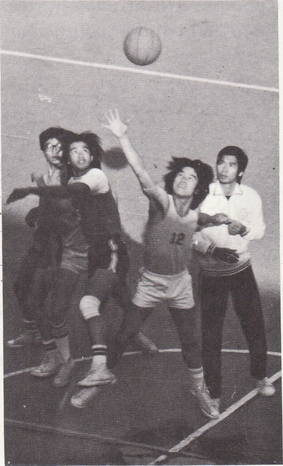
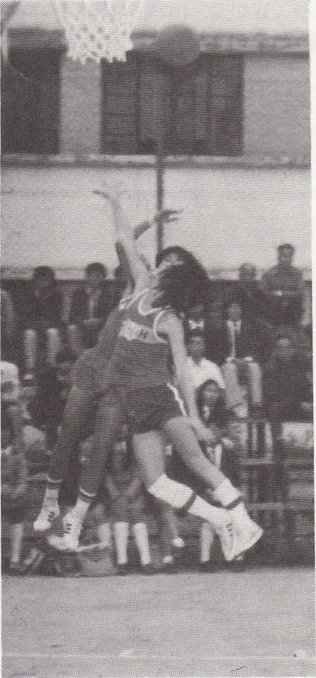

# Wah Yan Star 1976 - Page 85

## Extracted Photos & Figures





## Page Text Content

```text
Message From The Sports-Master
WYe have come to the end of a very satistactory
year, both in the Inter-School
Competitions and within the school.
In the Inter-School Competitions Wal Yan teams
won awards in nearly every sport.
A Grade
Basket-ball
Badminton
Track and Field
Hand-ball
Champions
Runners-up
Third （Third division）
Promoted to First Division
Champions
B Grade
Football
Third
C Grade
Table-tennis
Champions
Swimming
Runners-up （Second Division）
Badminton
Kunners-up
Life-savingq
Tlird
Our A Grade Handball team, having been runners-up in the Hong Kong area
ol the Inter-School Competition, went on to win the overall championship.
Our Lnvitation Kelay eam members deserve the niglest praise, not just for theu
achleveients in winning six out of ten relay races but especially for their spirit and
regular voluntary training
Within the school we had Inter-class and Inter-house competitions as well as the
annual Athletic Neet and the Swimming Gala. The
Athletic
Neet was held at the
Government Stadium during the month of February. A total of five records were bro-
ken.
The Swimming Gala was held at the Morrison Hill Pool during September and
ten new records were set up.
Keen and spirited sportsmanship marked these competi-
In the Inter-house Competition Blue House （L6S, 4Al, 2B） won the champion-
shup with 2839½ pounts followed by Green House （5B, 3Al, IB） with 2603 points.
The
Sportsman of the Year was Ng Chun Hung of Lower 6 Arts
Our C Grade footballers and basketballers could be keener and more co-operative
about training. They also lacked some of the fire and ‘'never say die'
spirit of our A and
Congratulations to all on a most successful and stimulating year.
```
