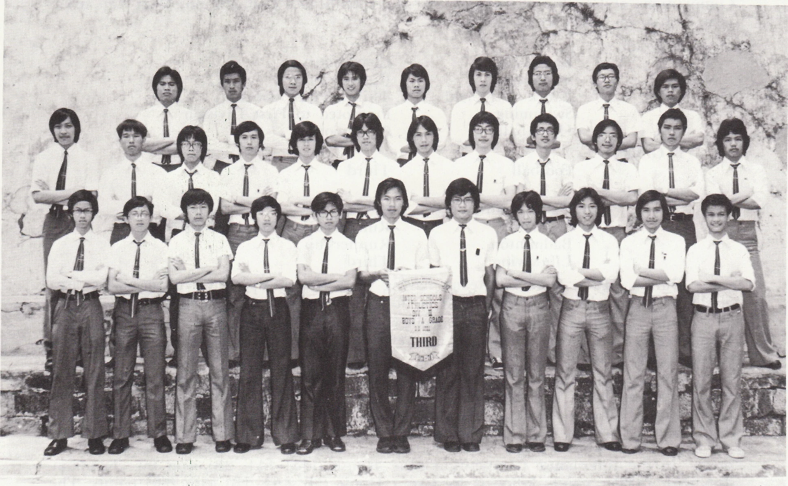

# Wah Yan Star 1976 - Page 86

## Extracted Photos & Figures



## Page Text Content

```text
ATHLETICS
THHIRD
This year's Interschool Athletic Neet （Division III）， organised by the Hong Kong
SCliools Sports assocation, was held on Sth and 9th of Narch at the Hong Kong Govern-
ient Stadium.
Our team consisted of 46 athletes and altogether took part in 33 events. Nany of
our boys did quite well and managed to get into the finals. We won 14 mesals and came
Third in Boys' A Grade with 46 points.
Un fortunately, the results were not quite satis-
factory in Band C grades. We totally scored 69 points and finished 9th in the Overall
Result in Division IIl.
Results：
A Grade
100 M.
200 M.
110 M. Hurdles
4 × 100 M. Relay
4 x 400 M. Relay
B Grade Shot Putt
C Grade
800.M.：
Shot Putt
Chu Kam Tong
Ng Chun Hung
Cheung Wai Shing
Ng Chun Hung
Lam Shu Shing
Yeung Siu
Chu Kam Tong
Pang King Chi
Cheung Yuk Tong
Li Yat Kwong
Chow Wai Keung
Ma Tak Shing
Leung Kit Fung
Leung Kit Fung
```
