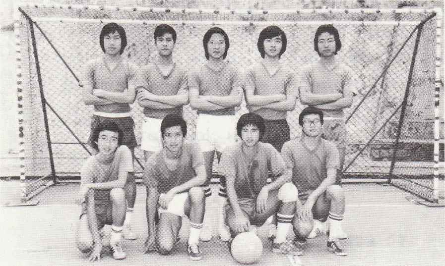
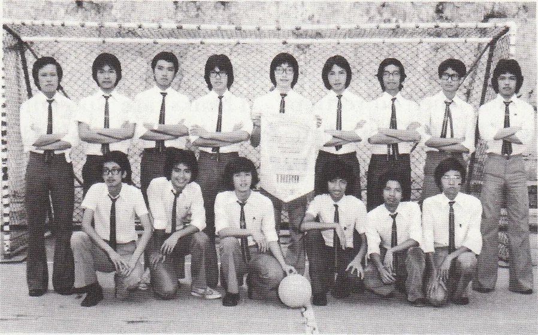
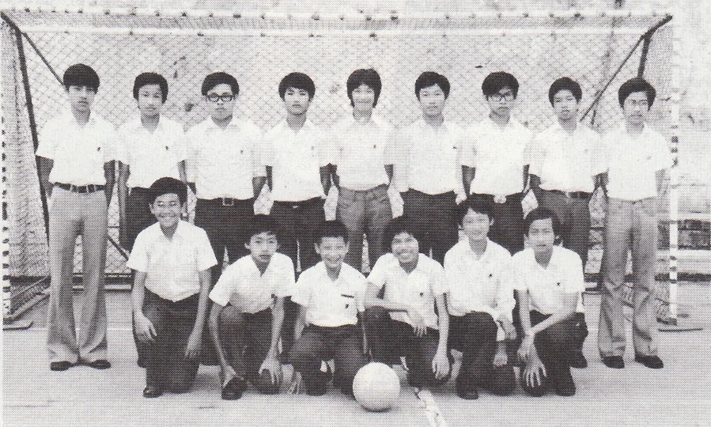

# Wah Yan Star 1976 - Page 90

## Extracted Photos & Figures





## Page Text Content

```text
FOOTBALL
Can a team display good performances without training' Can a team get satisfactory
results without practising? Of course, it is im possible. But, unfortunately, or we should say
rather humorously,that was the situation in Wah Yan's A and B grade football teams. We
had no fxed coaches and no standard grounds to practise at all! We sincerely hope that
the school may find a way to solve this problem.
A GRADE
As most of the best footballers in
Wah Yan had gone, we were quite in
despair of forming a team at the begin-
The team fnally formed was weak
and delicate and without unity and co-
operation. So, actually, it was quite for-
tunate for us that we could enter the fnal
round.
But, strange enouga, in the finals, we
still had a great chance to scramble for
the championship, as there was not even
a single team
which was outstanding
enough to beat us. But we failed, only
finishing in the League. We did not par-
ticipate in the Knock-out Competition.
④）
BGRADE
This year, half of our team was com-
posed of new players. So, at the begmn-
ning,team work was poor.
But we tried
to improve througl the matches.
managed to get via the semi-fnal into the
final round.
But then, our team was
handicapped by injuries.
We did badly
in the final matches, losing 2 matches
and winning only one in which our op-
ponent was disqualifed. The result was
that we came Third in the League.
C GRADE
This season，
were anew team.
We were not brilliant in skill and we did
not have suffcient time to practise. In
the competition, we lost 3 matches, and
drew out. So, we were knocked out of
the finals. Though we did not do well.，
we indeed could learn a lot in skill and
cooperation, and much knowledge of
football.
```
