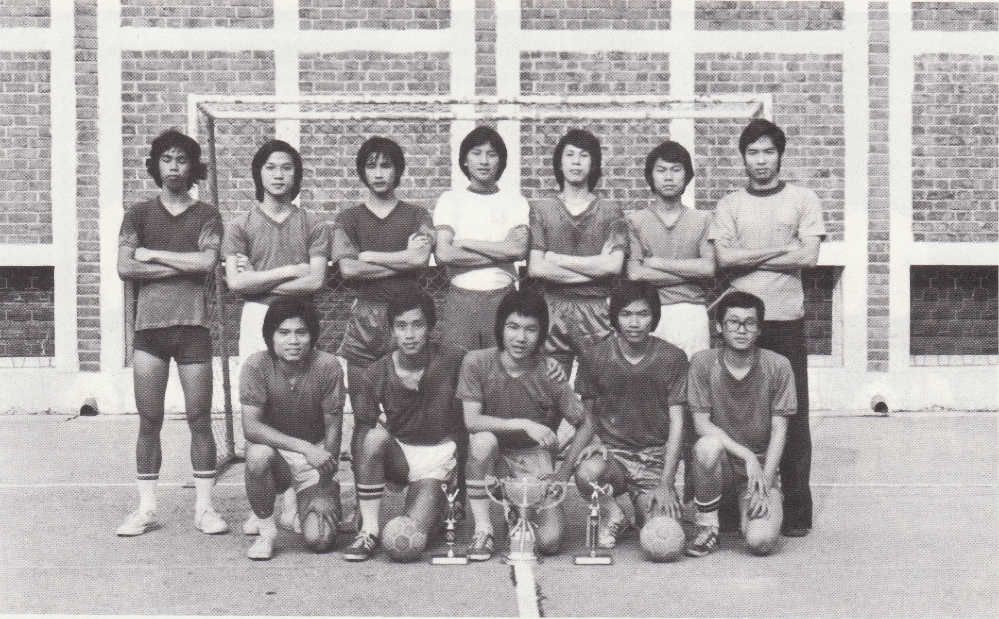

# Wah Yan Star 1976 - Page 91

## Extracted Photos & Figures



## Page Text Content

```text
HANDSALL
INTERSCHOOL CHAMPIONS
Our team was basically composed of the basketball
and badminton players.
Though we started practising,and in fact, we learned playing handball only a week
or two before the real match came, we were quick to acquire the fundamental skill, as
handball is only a game combining all the knowledge and skill of basketball, badmin-
ton, football and volleyball.
Regioual
In the Regional （H.K. Area） Competition, we frst beat Cheung Chuk Shan Col-
lege and then International School. But in the final match against Ling Nam Middle
School, we had underestimated our opponents' ability, and we lost by 1 point！
Operall
At first, we were indeed quite depressed by this failure. Afterwards, we streng-
thenedl ourselves up and aimed for another award: the Overall （H.K.， Kowloon & the
N.1.） Championship. Gaining experience from the previous defeat, we played hard
and practised hard. Both our skill and our team-cooperation leapt a great step forward.
At the final, we again met Ling Nam, But this time, we had made considerable im-
provement, and we were well-prepared. The final match was really a thriller for the
spectators.
It was filled with tenseness and antagonism from the very beginning to the
very end. During the game, one of our players was knocked unconscious.
But we
played on calmly and hard. Finally our hope to capture the Overall Championship
did not fail. We won by 11-9.
```
