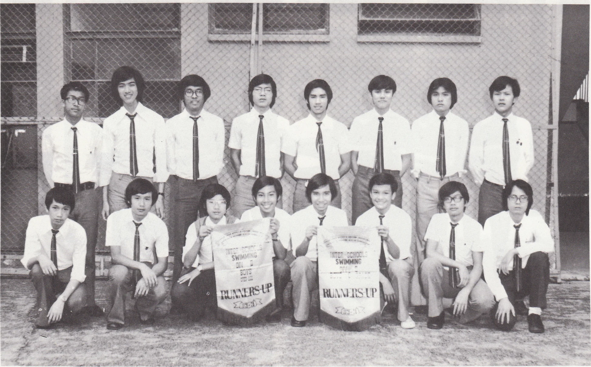

# Wah Yan Star 1976 - Page 92

## Extracted Photos & Figures



## Page Text Content

```text
SWIMMING
RUMNERSUP
RUNMIS UP
This year, our team was made up of highly talented swimmers.
We practised twice a
week,and even daily sometimes.
We had our award: with 121 points, we got the Overall
2nd in the Interschool Swimming Gala, and our C boys also got 2nd in their grade. We
will be promoted to Division l next year.
Results：
A Grade
B Grade
Poon Sek Kwong
Hui Chi Sang
So Man San
C Grade
Leung Kit Fung
Cheng Ka Chun
50m. Back Stroke
100m.
Back Stroke
50m.
Back Stroke
50m.
Back Stroke
200m.
Individual Nedley
100m.
Breast Stroke
200m.
Individual Medley
50m.
Back Stroke
200m. Individual Medley
200m. Nedley Relay
Srd
Ist
Ist
Leung Kit Fung
Cheng
Ka Chun
Chan
Ting Fai
Shum Sze Ho
We also participated in the Interschool Life-saving Competition. We did not do well，
but our C grade boys still managed to get 3rd.
Results：
A Grade
C Grade
Leung Wing Fung
Leung Kit Fung
Chan
Ting Fai
Torpedo Tow
Rescue Tow
Hair Carry
Ist
```
