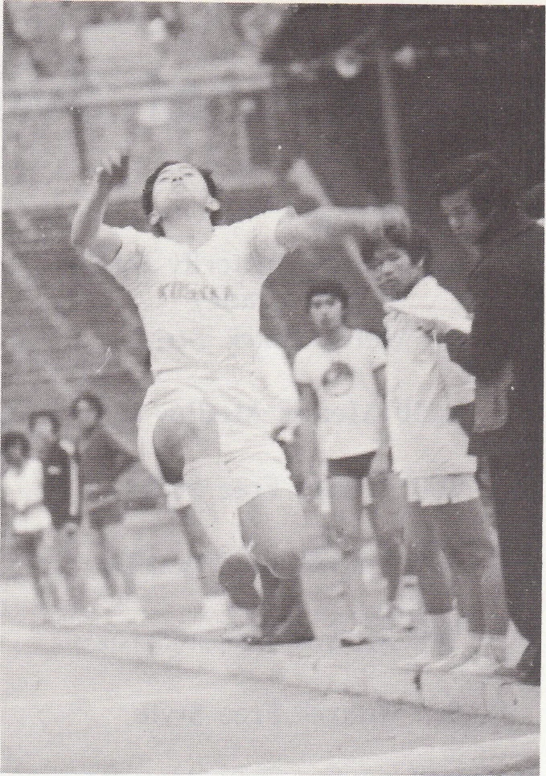
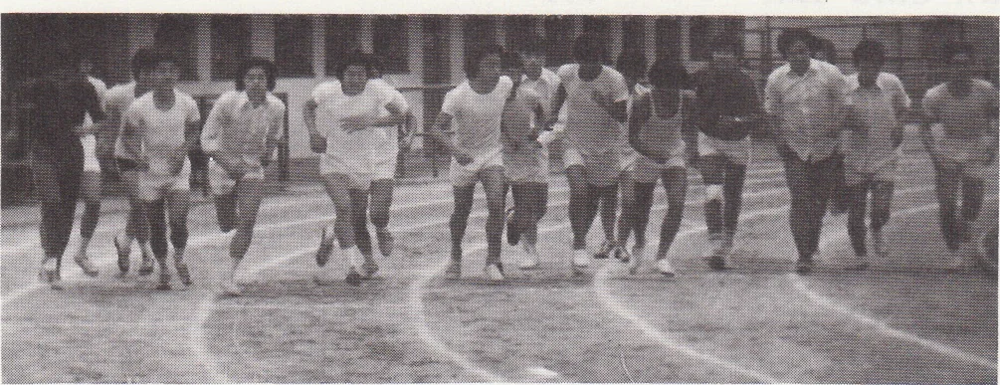
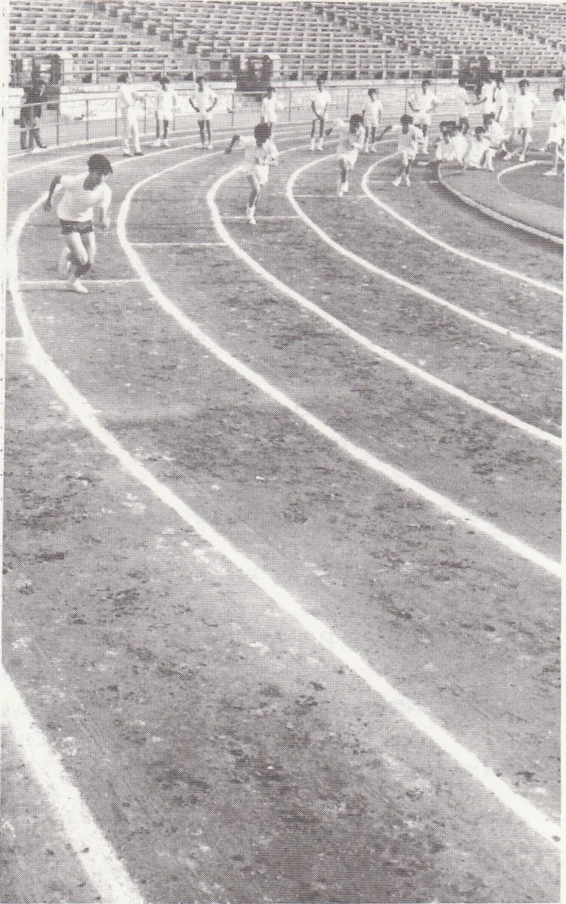
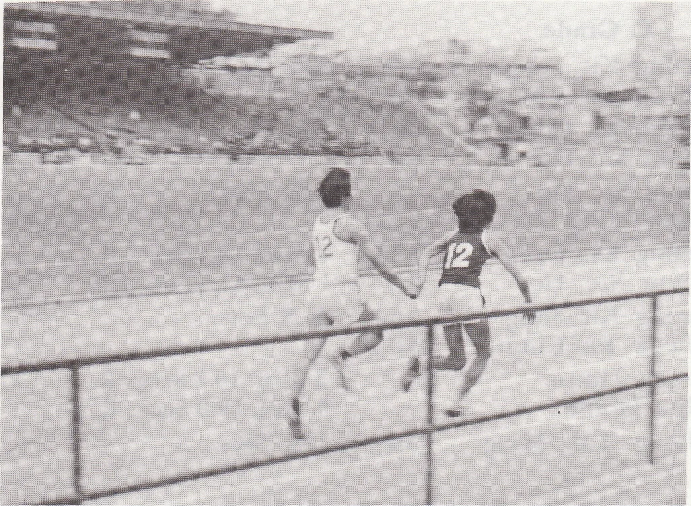

# Wah Yan Star 1976 - Page 96

## Extracted Photos & Figures






## Page Text Content

```text
SPORTS
OAY
The Annual Auletic Meet was held on February 19 （9.00 a.m. - 5.00 p.m.） and
24 （9.00 a.m.- 12.00 noon），1976, at the Hong Kong Goverment Stadium.
sults of this year were up
to usual standard, especially in the Track event. Totally
5 records were broken: 3 in A ggrade, l in B grade and 1 in D grade.
A new iten, the 4 x 400 m. relay was held. The frst Champions in the 3 grades
were Red, Blue and Green House respectively.
There were three special happenings
tlat were
well-worth-while mentioning：
the competition between supporting teams
ol dilterent Houses, the setting up of
Mark Sheets at the Stadium and tie pre-
sentation of prizes immediately after the
Neet. All this
served
to lighten the
atmosphere as well as to inspire the spirt
of the participants.
```
