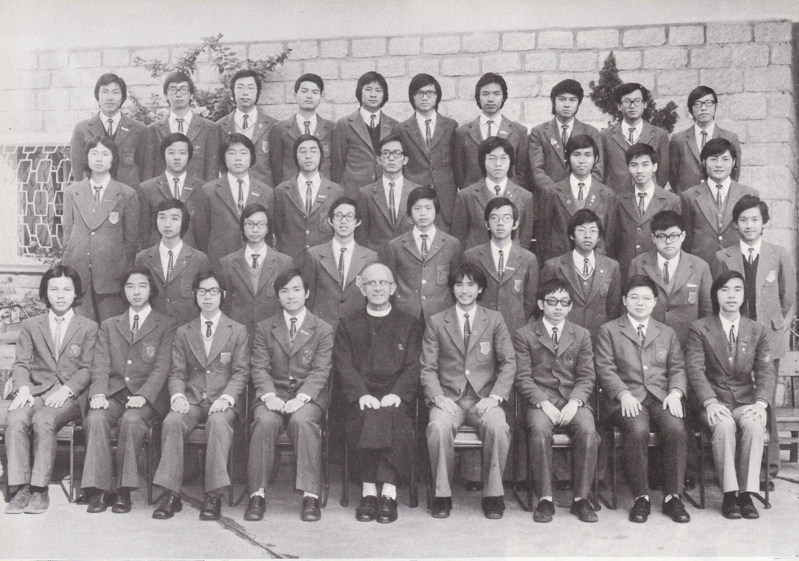

# Wah Yan Star 1976 - Page 106

## Extracted Photos & Figures



## Page Text Content

```text
L.
2.
3.
4.
5.
6.
8.
9.
10.
11.
12.
13.
14.
15.
16.
17.
18.
Au Kin Kwok
Chan Sik Pok
Cheung Yuk Tong
Chiu Schumann, Paul
Chok Kin Ming,Josiah
Chu Kam Tong, Andy
Chu Tat Kwong
Fung Kwok Kin
Keung Shui Cheong
Lai Chuk Fai
Lam Ching Fung
Lam Man Pan, Thomas
Lam Puy Chung, Dominic
Lam Sai Ming, Stephen
Lau Chiu Kit, Paulus
Law Kai Man
Lee Hin
Lee Tung Hoi
Fr. McGaley
LOWER FORM 6 ARTS （1975-76）
Absentee: 30,37
19.
20.
21.
23.
24.
25.
26.
27.
28.
29.
30.
31.
32.
33.
34.
35.
36.
Lee Yok Shiu
Li Chi Keung, Adolphus
Li Yat Kwong
Lo Chi Shun, James
Lui Siu Seck
Lui Tai Lok
Ng Chun Hung
Ngq Siu Fai
See Ching Fai
Szeto Ping Fai
Tan Chuen Yan, Paul
Wong Chak Kong,John
Wong Kam Fai, Ravmond
Wu Hon Cheong
Yau Kai Hong,Jot
Yiu Hi Cheong
Yim Pak Keung
Yung Kwok Hung,Kenneth
37. Tong Ping Fai
李煜紹
李志强
李日光
盧志信
呂少碩
呂大樂
吳俊雄
吳少輝
施淸輝
司徒炳輝
陳傳仁
王澤剛
黃錦輝
胡漢昌
邱繼康
姚起昌
嚴柏强
翁國雄
唐焫輝
```
