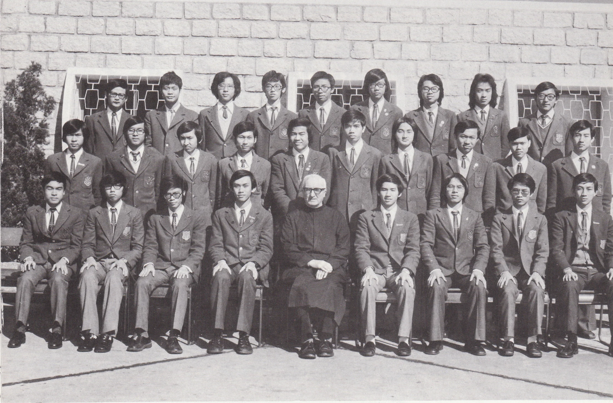

# Wah Yan Star 1976 - Page 107

## Extracted Photos & Figures



## Page Text Content

```text
Fr. Toner
1. Chan Man Shun
2.
3.
4.
5.
7.
8.
9.
10.
11.
12.
13.
14.
Cheng Kwok Ming
Chiu Tso Mei
Chow Kiang Cheong
Chu Tai Hang, Henry
Chui Chi Fai
Kong Yu Key
Lai Ying Kin
Lam Hang Fung
Lau Sik Tim, Richard
Law Sin Kin
Leung Wing Fung
Mak Chee Fai
Ngan Sau Fung
LOWER FORM 6 SCIENCE （1975-76）
朱
朱
崔
賴
林
劉
粱
桨
15.
Pang Che Hong
16.
Pang Chi Yan
17.
Poon Sek Kwong
18.
Tam Hon Wing
19.
Tang Hee Wah,Miller
20.
Wong Chun Leung
21. Wu Lai Chi
22.
Wu Ying Kin
23.
Yeung Chun Kwok
24. Yip Yau Jim
25.
Yu Chi Chak
26.
Yu Hon Kong
27.
Yu Wai Kun
28.
Yuen Chi Hung
29. Wong Kwok Fung, Stephen
```
