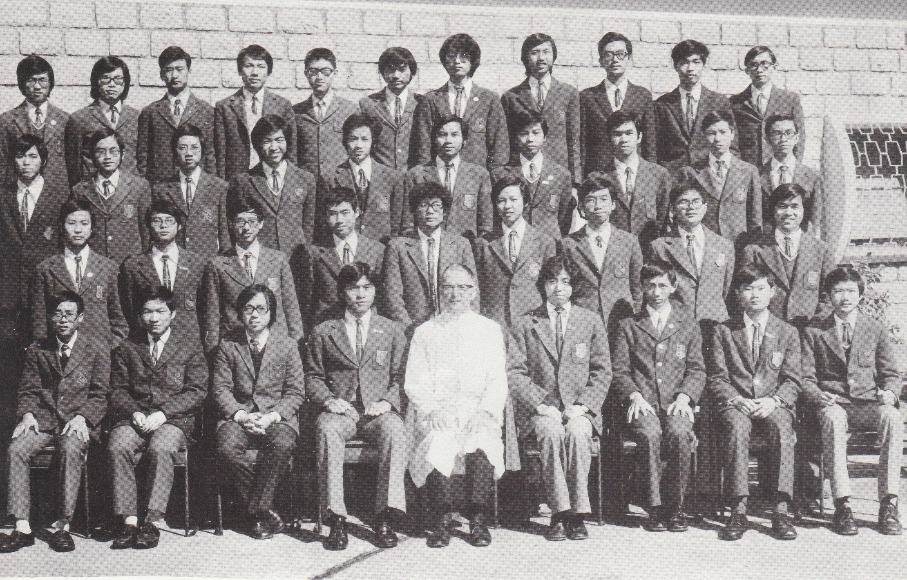

# Wah Yan Star 1976 - Page 108

## Extracted Photos & Figures



## Page Text Content

```text
1. Au Kin Tung
2.
Chan Kwong Kuen
3.
Chau So Wah
4.
Chau Yik Ng
5.
Cheung Wai Man
6.
Cheung Wang Yuen
Chiong
Kam Yueng
8.
9.
10.
11.
12.
13.
14.
15.
16.
17.
18.
Cho Chung Kwai
Choi Kam Piu
Choi Lung Chin
Chow Tak Cheong
Chow Wai Chung
Hau Tat Kwonig, Andrew
Ho Shiu Wei
Ho Tai Cheong
Hui Chi Sang
Ip Kin Fung
Kwan Wai Kin
19. Lai King Shing, James
黎
Fr. O'Rourke
FORM 5A（1975-76）
20. Lam Kee Chok
21. Lau Tat Yin
22.
Law Shiu Kai
23.
Leung Man Kam
24.
Luk Chi Lok
25.
Ng Kai Ming
26.
Ng Mun Sing
27.
To Tak Shun
To Wing Tai, Peter
29.
Wong Huck Keung
30.
Wong Tak Kin
31.
Wong Wai Hon
Woo Kong Sang, John
33.
Wu Kam Fu
34.
Yau Siu Lun
35.
Yeh King Yeung
36.
Yeung Ping Keung
37.
Yuen Moon Sing
成
38.
Yuen Wai Kei
林其作
劉達賢
羅紹佳
梁交。
陸志
吳
：介明
吳敏誠
杜德
信
杜永泰
黃克强
黃
堅
黃
吳港生
胡錦富
游兆麟
業景洋
楊炳强
阮满成
阮偉祺
```
