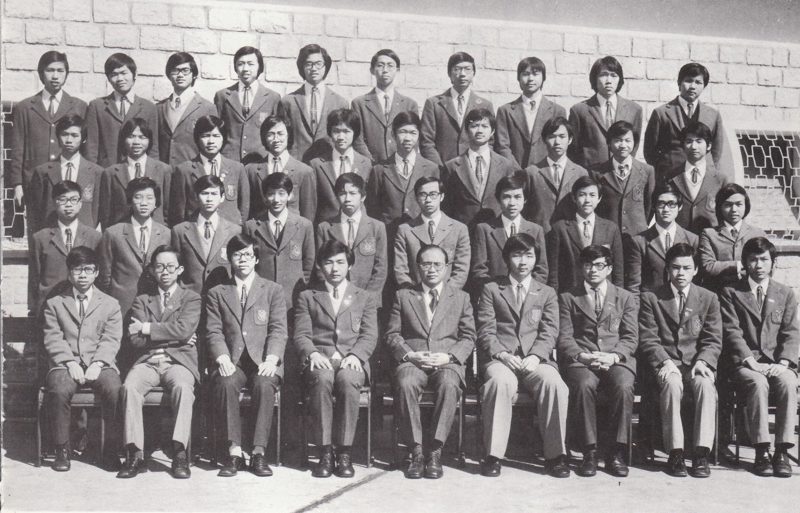

# Wah Yan Star 1976 - Page 109

## Extracted Photos & Figures



## Page Text Content

```text
1. Chak Chon Chi
2.
Chan Chun Fat
3.
Chan Tsu Ming
4.
Cheung Wing Sun
5.
Cheung Yan Chung
6.
Chiu Yu Keung
7. Chong Kim Wai
8.
Chow Chi Hung
9.
Fung Kwai Chiu
10. Jor Ting Ki
11.
Kwok Wai Leung
12.
Lam Chor
13.
Lam Chung Wing
14.
Lam Kin Keung
15.
Lam Ping Kit, Paul
16.
Lau Kam Chiu
17. Lau Kwok Kwong
18.
Lee Chi Fung,Paul
19. Lee Wood Wai
Mr.M. Cheng
FORM 5Al（1975-76）
翟創志
陳春發
陳祖明
張永新
張仁淙
趙汝强
莊劍偉
鄒志鴻
馮
貴潮
左定基
郭徫樑
林
礎
林仲榮
林徤强
林秉傑
劉錦釗
劉國光
李智峯
李活偉
20.
21.
22.
23.
24.
25.
26.
27.
28.
29.
30.
31.
32.
33.
34.
35.
36.
37.
Leung Ka Chiu
Leung Shing Keung
Li Kar Cheung
Ling Kit Man
Lo Chit Ki
Ma Wai Bong, Spencer
Mak Kin Wah
Pang Woon Chang, Louis
Poon Chung Ho, David
Pun Sze Ning, Sherman
So Ming Chi
Tong Yi Hong
Tsui Chi Keung
Wan Siu Yin
Wan Wai Cheong
Wong Yik Lok
Wu Shu Key
Yeung Kwok Kuen
38. Yu Cho Shing
梁家樵
梁誠强
李家祥
废
傑文
濯
基
馬
麥
彭煥璋
仲豪
潘仕能
蘇
明治
唐依康
徐志强
温兆賢
温
1維昌
黃億樂
胡樹基
楊國權
羽祖承
```
