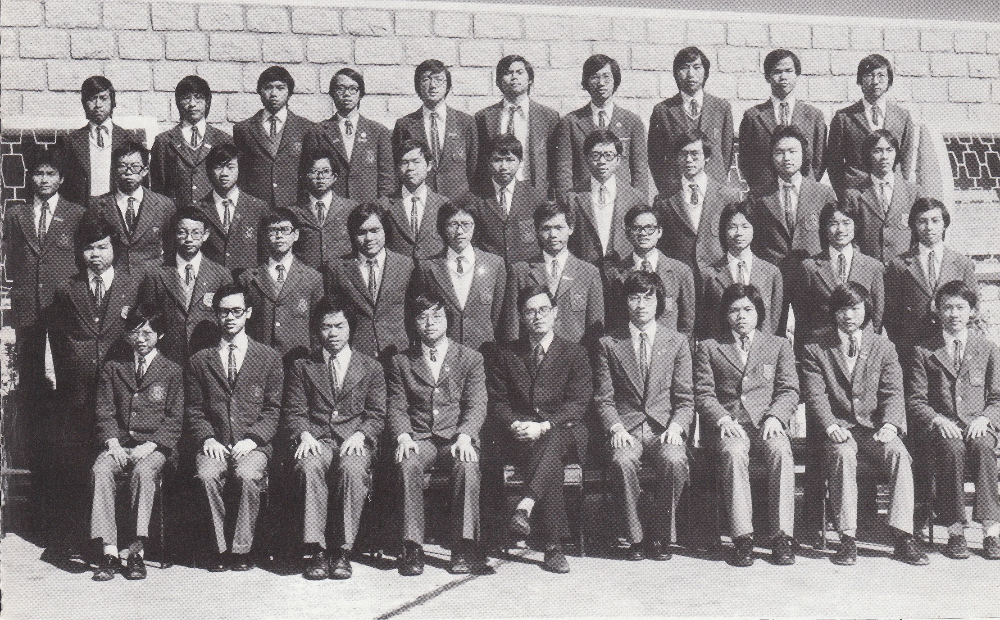

# Wah Yan Star 1976 - Page 111

## Extracted Photos & Figures



## Page Text Content

```text
1. Chan Din Man
2.
3.
4.
5.
6.
7.
8.
9.
10.
11.
12.
13.
14.
15.
16.
17.
18.
Chan Kwok Ming
Chan Ming Hee
Chan Wai Po
Chan Wing Moon
Cheng Tat Cheong
Cheung Wai Sing, Daniel
Chik Hoo Wai
Ching Kwok Leung
Choy Hung Kai
Fung On Kung
Ho Wai Nam
Hui Chi Keung
Ip Kwong Moon
Kwan Pak Cheung
Kwok Shiu Shing
Lam Kwok Ming
Lam Shu Shing
19. Lee Hoi Shuen
S
Mr.K.P. Lee
FORM 5B1（1975-76）
成
明
成
海旋
20.
Lee Kwong Yee, Peter
21.
Lee Shiu Kwong
22.
Lee Shui Pin
23.
Lee Wang Fai
24.
Li Kwok Hung
25.
Lui Chun Shing，
Frederick
26.
Mang Tat Him
27.
Ng Long Yan
28.
Sze Chung Ta
施
29.
Tam Kwok Cheung, Dominic
譚
30.
Ting Kwang Yuan, Edmund
31.
Tse Siu Hon
32.
Tse Yat Lung
33.
Tsui Anthony
34.
Wai Ping Chuen, Henry
35.
Yeung Man Hung
36.
Yuen Ka Pak
37.
Yuen Kai Yin
38. Yu Tat Chi
女
阮家魄
阮啓賢
余達志
```
