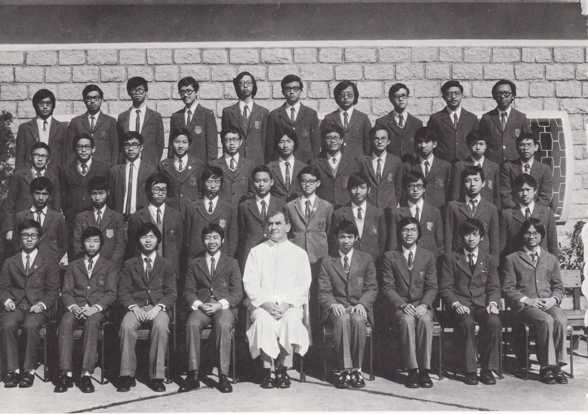

# Wah Yan Star 1976 - Page 112

## Extracted Photos & Figures



## Page Text Content

```text
1.
Au Cham Sum
2.
Chan Kai Ming
3.
Choi Chi Keung
4.
Choy Man Lap, Felix
5.
Chung Kwok Wing
Fung Ming Keung
7.
9.
10.
11.
12.
13.
14.
15.
16.
17.
18.
19.
Fung Wing Yin
Kar Wai Kam
Ko Man Leung
Kwok Chun Tat
Lai Sau Cheong, Simon
Lai Tze Chuen
Lam Kwan Sing, Paul
Lam Ngok Sum, Anthony
Lau Shu Cheung
Leung Chi Ho
Leung Ping Yu
Liu Lap Ming, Peter
20. Lo Wing Sun
Fr.Foley
FORM 4A（1975-76）
21.
Ma Kwok Ki
22.
Ma Wai Kwok
23.
Mak Hee Yiu
24.
Mui Kai Yeung
25.
Ng Man Yan
26.
Ng Shun Sing, Peter
27.
Pang Chung Yin
28.
See Nung Wai
29.
Tang King Yin
30.
Tang Lok Sang
31.
Tang Wai Leung
32.
Tang Yun Sang, Ignatius
33.
Tong Chun Yip, Peter
Wong Nai Sum
35.
Wong Siu Shun
36.
Wong William
37.
Wong Wing Kwong
Woo Chi, Archibald
39.Yeung Kin Wai
40. Yuen Wai Lun
伍
施
鄧
鄧
唐
致
楊建偉
袌惠倫
```
