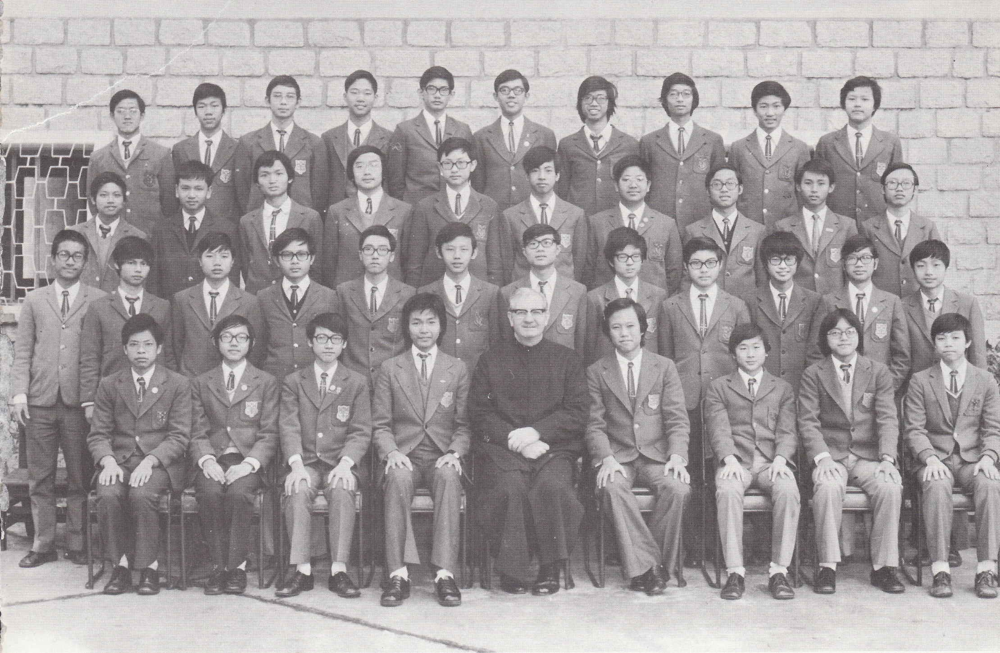

# Wah Yan Star 1976 - Page 113

## Extracted Photos & Figures



## Page Text Content

```text
1. Au Hing Cheung
2.
Chan Chi Kin
3. Chan Kin Wah
4.
Chan Tak Him
5.
Chan Wai Kuen
6.
Choi Yiu Kuen
7.
Chong Yu On
8.
Fong Wing Sum
9.
Fung Chi Wing
10.
Fung
King Tak
11.
Fung Wah
12.
Hui
Kuen Tak
13.
Ip Moon Chi
14.
Keung Kam Lun
15.
Lai Cheung Wah
16.
Lau Wai Keung
17.
Lee Chi Ming
18.
Lee Kon Chung
19.
Leung Kun Yu, Vitus
20. Leung Kwok Lun
Fr. Farren
FORM 4A1 （1975-76）
區慶祥
21. Leung Pak Yin
陳
志
堅
陳
22. Leung Wai Yuen
建
23.
Leung Wing Wah
德
24. Li Carlson
陳偉權
25.
Liu Chi Ho
蔡耀權
26. Liu Ping Tong
莊裕安
27. Lo Chiu Kwan
方榮
：深
28.
Lui Wing Chiu
馮志榮
29.
Lun Caesar
馮敬德
30.
Mok Kam Tim
馮
驊
31.
Ng Ka Yuen
許權德
32.
Poon Ying Lun
柴
滿枝
33.
So Wing Leung
姜
錦倫
34.
So Ying Lun
黎昌華
35.
Tam Lap Kun
偉強
36.
Tang Chi Sing
李
志明
37.
Tse Pak Shing
幹
聰
38.
Wai Yip Fan,Frederic
瑾
如
39.
Wong Chi Ho,Joseph
梁.國倫
40. Wong Kai Nam
梁柏賢
梁偉源
梁榮華
李嘉信
廖志豪
廖炳堂
盧超羣
呂榮照
藺
莫 錦添
吳嘉源
潘應麟
蘇永良
蘇英麟
譚立勤
鄧志成
謝百成
韋業勳
黃智豪
黃啓南
```
