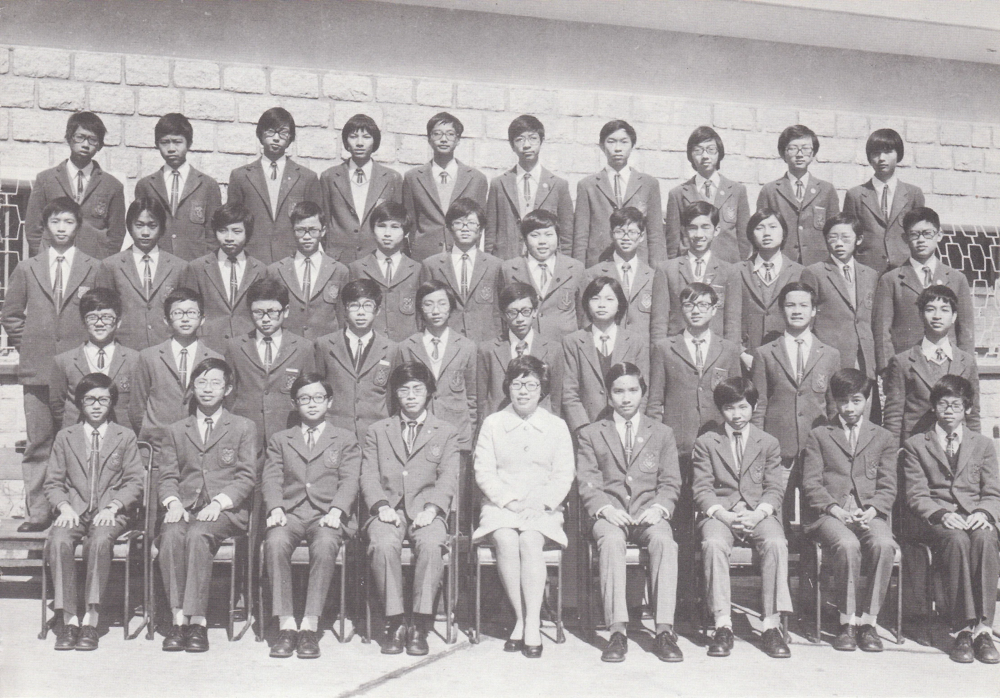

# Wah Yan Star 1976 - Page 117

## Extracted Photos & Figures



## Page Text Content

```text
1. Chan Hon Ming, Joseph
Chan Ka Shu, Kenneth
Chan Kam Kwok
4.
Chan Ting Fai
⑤
Chan Wai Hong, Patrick
6.
Chang Shian Wei, Willy
7.
Chung Ka Wai, David
Fung Siu Lun, Anthony
9.
Ho Hon Keung
10. Iu Ming Chung, Peter
11. Lai Wing Hong, Joseph
12.
Lai Yee Tak, Joseph
13.
Lam Fan Keung, Franklin
14.
Lam Tze Ming
15.
Lau Kin Sun
16.
Lau Sze Keung
17.
Lee Tung Leung
18.
Lee Yee Kai
19.
Leung Chi Hung
20. Leung Kit Fung
Mrs. Lee
I
FORM 3A1（1975-76）
21.
Lo Tak Shing,Peter
22.
Lo Yuk Kwai
23.
Lui Wing Kei
24.
Mak Chi Kei
25.
Ng Ki Chong
26.
27.
Pang Heung Wing, Winston
So Kuen Fai
28.
Tang Kwok Hogg
29.
Tsang Chi Chung
30.
Tseung Sik Yin, Stephen
31.
Tsui Hing Chung
32.
Wong Hoi Man, Lawrence
33.
Wong Kwok Fan
34.
Wong Kwok Wai, David
35.
Wong Sing Ho
36.
Wong Yiu Wah
37.
Yeung Fu Yiu
38.
Yu Po Man
39.
Yuen Hong Sang, Anthony
40.
Yung Chiu Wah,Sammy
羅德成
羅玉𡖂
雷永基
麥之琦
伍琪莊
彭向榮
蘇權輝
鄧
國
曾
蔣
徐興中
黃凱民
黃國藩
黃國偉
黃星浩
黃耀華
楊富耀
余寶民
阮康生
容昭華
```
