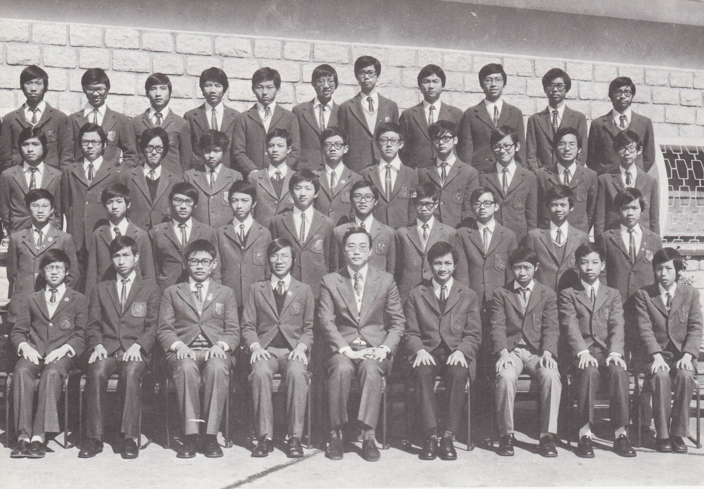

# Wah Yan Star 1976 - Page 118

## Extracted Photos & Figures



## Page Text Content

```text
Chan Kai Keung
2. Chan Kai Leung
3.
Chan Man Hon
4. Chan Wing Sang, Michael
5.
Chau Ka Wai, Tony
6. Cheng Ka Chun
7. Cheung Kar Kin
8.
Ching Tak Chiu, Stephen
9.
Chong Tak Ming,Peter
10. Chow Chi Yan
11. Choy Ho Yuk, Anthony
12.
Hwu Lim Cho
13.
Kwan Kwok Kuen
14.
Kwan See Wah, Simon
15.
Lai Chong Kee, Soloman
16.
Lam Tsze Ho
17.
Lam Wan Lai, Bernard
18.
Lee Cheuk Man
19.
Lee Chiu Hung
20. Lee Ming Chi, David
Mr. M. S. Cheung
FORM 3B （1975-76）
21. Lee Sai Leung
22.
Liu Kwok Kwong
23.
Lo Kam Wing
陳
家
牛
偉
俊
建
昭
24.
Mak Shu Yiu
25.
Mak Tat Keung
26.
Shek Ming Tung
27.
So Man San
So Wing Kei
莊
鄒
蔡晧
胡念
關
國權
關仕華
黎
創
紀
林
子
顥
林
李
雲
卓
29.
Soo Shiu Shing
30.
Sze Tsai Tack, Ted
旭
31.
TTam Yiu Cheung
32.
Tang Pui Lam
33.
Tsang Chin Kwei, John
34.
Tsang Kar Fai
35.
Tse Wun Chai
36.
Wong Kai Tai, Michael
37.
Wong Sing Charn
38.
Wong Yih Keung
39.
Yip Chau Chung
非
40.
Yu Woon Chiu, Anthony
余
桓
```
