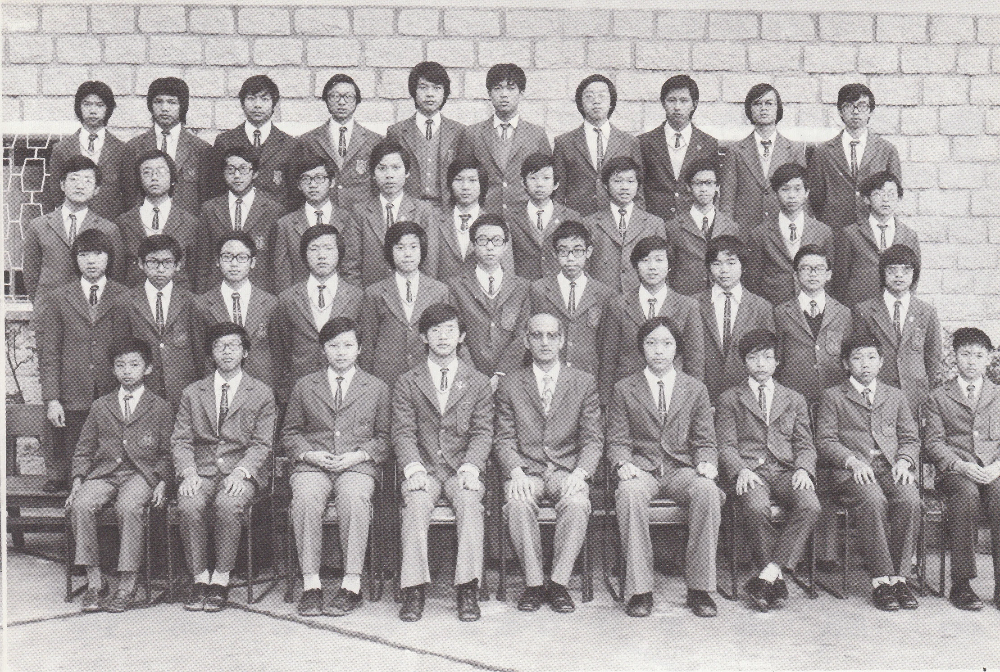

# Wah Yan Star 1976 - Page 119

## Extracted Photos & Figures



## Page Text Content

```text
1.
2.
3.
4.
6.
Chan Ping Chiu
Chan Shu Wing, Edward
Chan Tai Cheong, Alan
Cheng Kat Hung
Cheung Man To, Raymond
Cheung Shek Fai, Raymond
Chiu Hau Shun
Chiu Kwok Hung, Thomas
9.
Chow Wai Ping
10.
Chu Kwok Chuen
11.
Chu Kwok Keung, Stephen
12.
Chung Chi Bo, Paul
13.
Hui Chi Wing
14.
Hui Mo Sze
15.
Ku Tsu Tsau, Arnold
16。
Lam Cheuk Ming
17.
Lam Kwok Hung, Raymond
18.
Lam Yin Sze,Ignatius
19.
Lau Koon Man, Vincent
20.
Lee Bing Sum,Samuel
Mr. K. S. Fung
FORM 3B1（1975-76）
陳
陳
陳
21. Lee Chi Fai, Lawrence
22.
Leung Siu Kuen
23.
Li Man Wai, John
24.
Liang Gin Hung
25.
Lo Chi Wing
26.
Lui Pui Yuen
27.
Sham Shun Wai, Christopher
Siu On Kwok,Tommy
29.
Siu Tsz Chiu
30.
So Kin Kai
31.
So Kin Yee, Kenny
Sung Kin Chiu
Tang Kai Ming,Eddie
34.
Tao Wai Fong, Clarence
35.
Tong Share Man, Ryan
36.
Tse Chi Man
37.
Tse Kwan Hop, Tony
38.
Tsui Pui Wang, Ephraem
釜
李
39.
Wong Sui Lok
40.
Yee Sau Fun,Stephen
Absentee: 2
李志輝
梁兆權
李民威
梁展雄
羅志榮
呂佩源
岑迅偉
蕭安國
蕭子超
蘇建佳
蘇建義
宋建超
鄧啓明
陶懷方
唐社女
謝志女
謝君俠
徐佩宏
黃紹樂
余守訓
```
