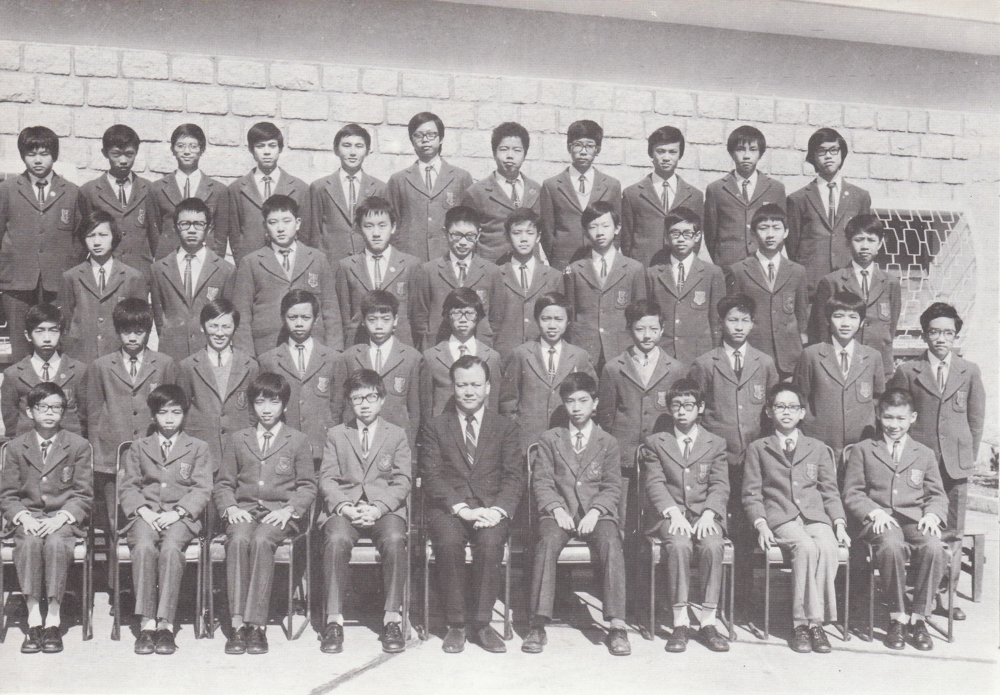

# Wah Yan Star 1976 - Page 120

## Extracted Photos & Figures



## Page Text Content

```text
1.
Cha Yat Chiu, Jonnny
2.
Chan Ho Ming, Raymond
3.
Chan Wai Kwok, Edward
4.
Chan Yiu Cheung, Anson
5.
Chau Hon Yip, Samuel
6.
Chen
Pin Li, Michael
7. Chin Tin Chee, Dominic
8.
Chung Wing Tim,Alain
9.
Fan Cheong Lun
10. Kwan Kai Hung
11. Kwan Ping Yiu, Martin
12.
Kwok Wing Chi, Edmund
13.
Kwong Cheuk Kun
14. Lai Ho Wan, Anthony
15.
Lee Hough Ton
16.
Lee Ming Chuan
17. Leung Kan Shun
18.
Leung
Ngah Ming, Albert
19. Leung
Sung King,Patrick
20. Li Ka Yin
Mr.C.H.Lee
FORM 24（1975-76）
查逸超
21. Lim Kim Sung, Jack
陳浩明
Lin Chi Shu
陳維國
Liu Hing Kit
陳耀章
24.
Lum Lap Kwan, Simon
周漢業
25.
Mak Dai Kwok, Paul
陳品立
26.
Mak Wah Lun, Valiant
陳天賜
27.
Ngg Chi Chung,Tommy
鍾永添
28.
Ng Paul
范祥麟
29.
Sham Ying Kei, Peter
關啓雄
30.
Tam Pui Kwan
關平耀
31.
Tam Sau Hung
郭永智
32.
Tang Chau Ming, Peter
鄺卓芹
33.
Tang Ming Sang, Thomas
黎浩雲
34.
Un Chi Chung, Victor
李厚敦
35.
Van Tak Sun, Winston
李明權
36.
Wong Wing Kee, Christopher
梁勤信
37.
Yeung Yiu Cho
梁雅明
38.
Yu Ka Hing
梁崇競
39.
Yuen Fan Fai
李家賢
40.
Yung Matthew
林金盛
林啓修
廖慶傑
林立羣
麥大國
麥華崙
吳子仲
伍保羅
沈應
譚沛君
談秀潓
鄧洲明
鄧明生
冀子聰
萬德生
黄永基
楊耀祖
余嘉慶
源奮輝
容孟夫
```
