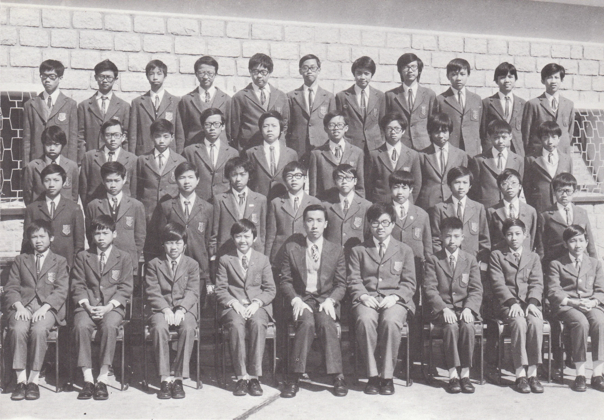

# Wah Yan Star 1976 - Page 121

## Extracted Photos & Figures



## Page Text Content

```text
1.
Chan Chi Fai, Herbert
2.
Chan Kwok Keung
3.
Chan Kun Sun
4.
Chan Wai Ming, Simon
55.
Cheng Yiu Wing
6.
Chow Pak Fai, Francis
7.
Chung Wing Hong
9. Hui Kin Cheung
10. Jor Chi Pang
11.
Kan Wai Ling
12.
Ko Chun Wa
13.
Kwan Bing Chung, Winkle
14.
Kwok Ka Chiu
15.
Lai Wing Tai, Peter
16.
Lau Ping Fat
17.
Lee
Kwong Hung, Anthony
18.
Lee Tak Man
19.
Lee Sze Yuen
20.
Leung Chi Chung
Mr.Koo
FORM 2A1 （1975-76）
21.
Leung Chi Hong, Luke
22.
Li Chi Fun
23.
Li Ka Keung
24. Li Kwok To
25.
Lo Chin Ling
26.
Lu Cheng En, Owen
27.
Ng Shu Bun, Andrew
28.
Peng Chi On, Andrew
29.
Poon Kwan Yiu
30.
Poon Yue Chee, Eddy
31.
Pow Wing Nin
32.
To Shu Cheong
33.
Tsang Chiu Yin
34.
Tsang Kwong Yuen
35.
Tsun Yat Lun
36.
Tung Chi Wah, Wally
37.
U Sai Ho, Eric
Wei Yeh Shing, Washington
39.
Wong Kwok Kwong
40.
Yeung
Siu Kui
梁
志
李志
李
國
羅稚
寧
呂承恩
伍樹彬
彭子安
潘均耀
潘宇馳
鮑永年
杜樹鏘
曾超然
曾廣源
秦日麟
董志華
余世豪
韋業勝
黃國光
楊少翑
```
