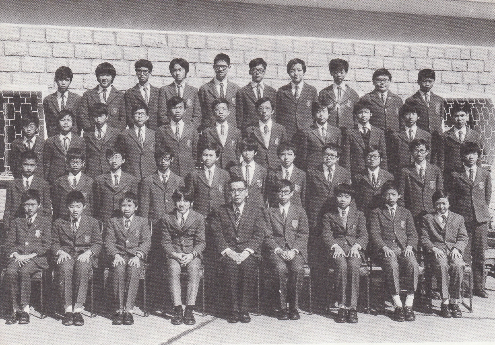

# Wah Yan Star 1976 - Page 122

## Extracted Photos & Figures



## Page Text Content

```text
Mr.C.T. Wong
1. Au Yeung Wan Kit, Alexander歐陽允杰
2. Chan Chin Lai, Alan
Chan Kam Sun
Chan Wai
Man
5.
6.
7.
9.
10.
11.
12.
13.
14.
15.
16.
17.
18.
19.
20.
Chau Chi Keung
Cheng Jiun Jan
Cheng Wai Man
Cheung Chi Hung
Choi Long Chau
Chow Chi Yan, David
Chuang Sze Ho
Fung Wing Wah
Hui Kam To
Kan Kai Sing
Lam Kwong Tin
Lam Wing Keung, Francis
Lee Kwok Sun, George
Lee Patrick Edmond
Lee Wai Man
Li Chi Chung
FORM 2B（1975-76）
21. Li Lak Kuen
陳展禮
22. Loong Yiu Cho
陳錦新
23.
Lung Ka Hon
陳偉文
24.
Ma Dat Sang, Anderson
鄒志强
25.
Ma Kai Sang
鄭俊彥
Mak Kam Fai
敻偉
汶
27.
Mak Wai Ho
張志
：雄
28.
Ng Chi kin
蔡朗
29.
Ng Chiu Yat,Morgan
周志
30.
Ng Man Chi
莊思
31.
Pang Shu Wing,Simon
馮永
Shiu Siu Fung
許錦濤
33.
Sim Cheng Hong
簡繼誠
34.
Tang Chi Chung
林廣田
35.
Tse Chun Hoi
林永强
36.
Wong Tak Jun
李國新
37.
Yu Wai Sing, Vincent
李啓彥
38.
Yu Yin Lok, Vincent
李惠
民
39.
Yuen Lap Yan
自
忠
40. Zay William
李勒權
龍耀祖
龍家瀚
馬達生
馬啓生
麥錦輝
麥偉豪
伍志堅
吳朝日
吳文智
彭樹榮
蕭少峯
沈振鴻
鄧智聰
謝
1海
黃德傅
余偉成
余衍樂
袁立人
芮威簸
```
