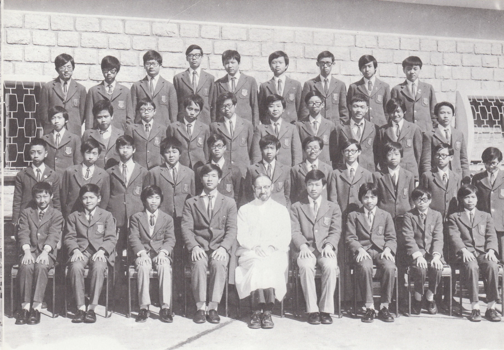

# Wah Yan Star 1976 - Page 123

## Extracted Photos & Figures



## Page Text Content

```text
1.
Chan Man Sum
Chan Shiu Lun, Christopher
Cheng Chan Ming
4.
Choy Chi Ho
5.
Chiu Hong Sing
6.
Chiu Yan Po
Chu Chun Kit
Chung Chuk Hung
9.
Fong Yuk Wai
10.
Fung King Keung
11.
Fung Tat Wah
Fung
Wai Lum
13.
Gee Sui Wah
14.
Kwok Kai Ming
15.
Kwok Wing Yin, Edward
16.
Lam Hoi Tat
17.
Lam Wan Hon, Edward
18.
Lau Kenneth
19.
Lau Ping Kwan
20.
Lee Chun Pong
陳
Fr. O Cearbhallain
FORM 2B1（1975-76）
21. Lee Fong Loi, Dominic
22.
23.
24.
25.
26.
27.
29.
30.
31.
33.
35.
37.
38.
39.
Lee King Chiu, Simon
Leung Chi Cheuk
Leung Tak Sing
Li Kai Wing
Lo Wai Kuen, Antony
Ma Tak Sing
Ma Wing Kai, William
Mak Wing Kwong, Thomas
Ng Kong Yip
Ng Kwok Cheung
Ng Ming Wah
Ngan Cheong Hang, Thomas
Pang Ka Po
Szeto Ching Hong, Tommy
Tam Ying Ho, Chester
Tang Chi Leung
Wong Kee Wong
Yue King Man
40. Yuen Yee Sang, Bede
Absentee: 4, 18
李方來
李景昭
梁志卓
梁德聲
李啓穎
盧偉權
馬德成
馬榮楷
麥榮光
吳江業
吳國祥
吳明華
顏昌恆
彭家寶
司徒景康
譚英豪
鄧智良
黃紀旺
余景女
阮怡生
```
