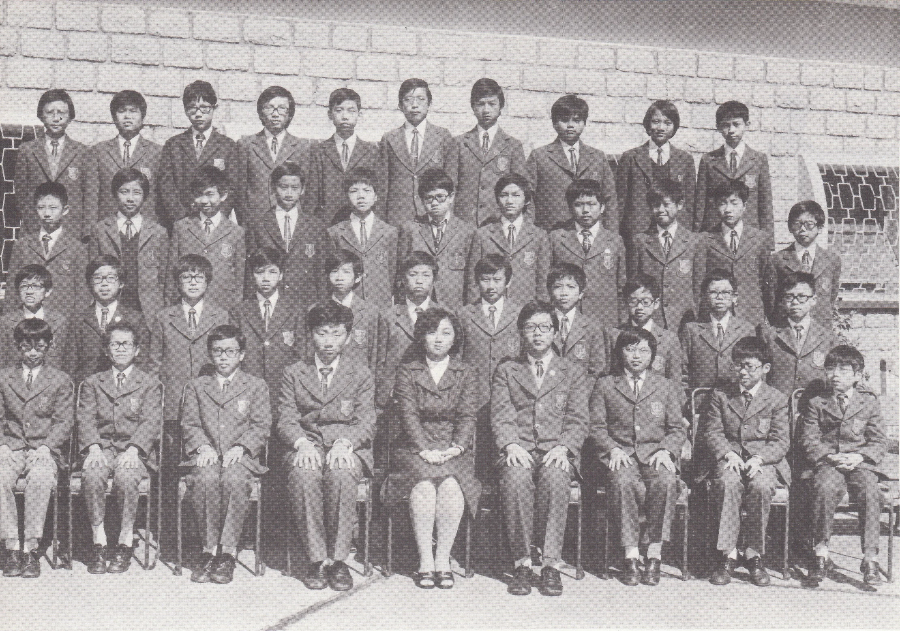

# Wah Yan Star 1976 - Page 124

## Extracted Photos & Figures



## Page Text Content

```text
1. Au Yeung Kam Lun, Robert
2. Chan Chi Hung
3. Chan Wai Kin
4.
Chan Yu
5.
Chan Yu Sum
6.
Cheng Ka Lok
7.
Cheng Ping Hei
8.
Cheng
Yat Yiu
9. Cheung Tat Shing
10. Chow Koon Mei, Louis
11. Chung Kai Yiu
12.
Fu Ming Wai
13.
Fung Mo Yan, William
14. Fung Yip Hang
15. Go Yat Man
16.
Ho Fu Wah
17. Ho Sai Kwan
18. Hui Wai Keung, Joseph
19.
Hsu Ka Kwai
20. Lam Man Tak, Kenneth
Mrs. Sze
FORM IA （1975-76）
歐陽錦稐
陳志雄
陳維健
陳
裕
陳宇琛
鄭家樂
鄭秉熹
鄭日耀
張達誠
周觀微
鍾啓耀
傅明偉
馮務仁
馮業鏗
吳逸民
何富華
何世坤
許偉强
徐家瑋
林女德124
21.
22.
23.
24.
25.
26.
27.
28.
29.
30.
31.
32.
33.
34.
35.
36.
37.
38.
39.
Lau Koi Lam
Law Pak Wai
Lee Kam Cheung, Anthony
Lee Kam Hong
Lee Yu Man
Li Sze Yiu
Mak Chun Hoi
Ng Ka Kan
Ng Pak Suen
Sham Chi Cheong
Sun Tak Man
TTsui Wan Sin
Wong Hin Chung
Wong Kam Pui
Wong Chi Sin
Wu Pui Tak, Arthur
Wu Yuet Tsen
Yang Ming Lik
Yeung Chung Lun, Thomas
40. Yuen Cheung Lun
Absentee: 2,8,9
徐
王
暴
羨
袁
```
