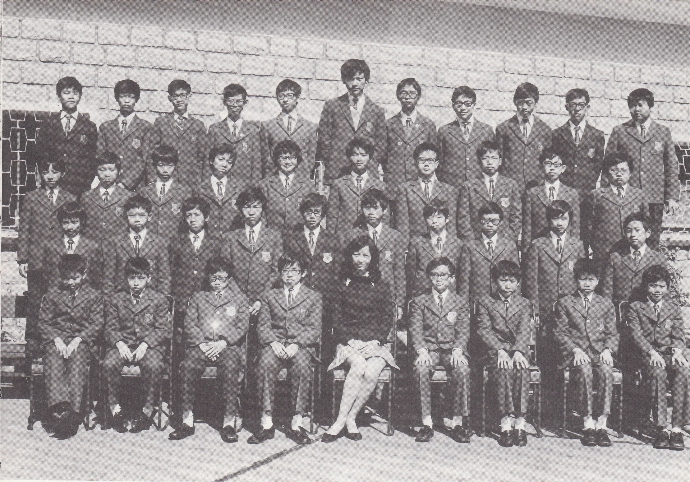

# Wah Yan Star 1976 - Page 125

## Extracted Photos & Figures



## Page Text Content

```text
1.
Chan Ka Keung
Chan Kwok Wai
3.
Chan Po Keung，
Paul
4.
Cheng Chun Hoi
5.
Cheuk Chun Keung
6.
Chew Ka Ming
7.
Choy Lee Man
8.
Choy Ming Fai
9.
Chung Ka Cheung
10.
Ho Kai Kwong
11.
Hui Tze Kai
12.
Hui Wing Kai
13.
Kho Eng Tjoan, Christopher
14.
Ko Man Pok
15.
Kung Ki Cheong
16.
Kwan Shiu Hin, Michael
17.
Kwok Siu Tin, Dominic
18.
Kwok Tun Ho
19.
Lai Man Ho
20.
Lai Yiu Wan,Peter
Miss Ng
FORM I Al （1975-76）
陳家强
陳國偉
陳步强
鄭俊開
卓俊强
趙嘉明
蔡利民
蔡明暉
鍾家昌
何繼光
許子佳
許永佳
許榮泉
高交博
龔其昌
關兆顯
郭嘯天
郭淳浩
、浩
耀
雲
21.
Lam Wai Kiu
22.
Lau Kwok Lap,Eddie
23.
Law Sing Wah
24.
Lee Sek Kwan
25.
Lee Tze Leung, Gerald
26.
Leung Chi Kit, Vincent
27.
Leung
Siu Kee, Martin
28.
Leung
Yun Yung
29. Li Chi Leung, Peter
30.
Lim John Swan
31.
Ma Chi Keung
Pun Ying Hung
33.
Soong Yuen To
34.
Suen Wa Yam
35.
Tsang Kwok Wing, Frank
36.
Tsui Kar Kui, Antony
37.
Tsui Pak Lun, Byron
38.
Wong Ho Yin, Lawrence
39.
Wong Kam Shing
40. Yu Siu Yeung, Peter
Absentee: 17
林偉喬
劉國.
立
羅星華
李錫君
李子良
梁子傑
梁兆基
梁潤榕
李賜良
林仕源
馬志强
溞應雄
宋遠圖
孫華欽
曾國榮
徐家駒
徐伯倫
黃浩然
黃錦成
余少陽
```
