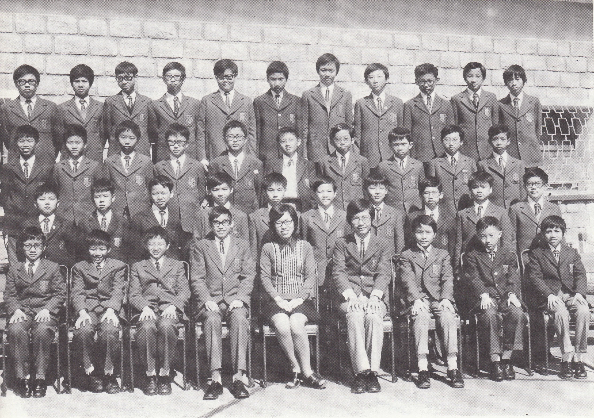

# Wah Yan Star 1976 - Page 126

## Extracted Photos & Figures



## Page Text Content

```text
1. Chan Cheong Ming,Dominic
Chau Hon Leung, Anthony
3.
Cheng Koon Wai
4.
Cheng Wai Hung
5.
Cheung Tin Shek
6.
Cheung Yu Shun
7.
Chow Sai Hoi, Paul
8.
Choy Tak Leung
9.
Chung Shek Wah
10.
Hwa Kai Chung
11.
Kwan Ki Pat
12.
Kwok Siu Ming
13. Lee Shing Cheung
14.
Lee Siu Ho
15.
Lee Tai Ming
16.
Lee Tak Wing, John Bosco
17.
Leung Kang Yan
18.
Li Chi Chuen
19. Lin Sau Tong, Calvin
20.
Lui Shu Ki
Miss Lam
FORM IB （1975-76）
陳昌明
21. Lo Chun Yu, Tobias
周漢樑
22. Lo Hin Ming
鄭官衛
23.
Low Chun Keung
鄭偉雄
24.
Lu Cheng Te
張天錫
26.
Mok Chi Ming
張裕信
27.
Ng Chin Hang
周世開
28.
Pak Siu Ming
蔡德良
29.
Poon Wing Dai, Cosmas
鍾錫華
30.
Pun Wing Chiu
許啓忠
31.
See Siu Nang
關基弼
32.
Suen Yuk Lam
郭兆明
33.
Tai Shih Chung
李成章
34.
Tam Wing Tsang
李紹豪
35.
Tang Shu Ki, Simon
李大明
36.
Tsoi Wai Leung
李德榮
37.
Wong Kam Hung
梁寅仁
38.
Wong Kwok Yin, Albert
李志專
39.
Wong Li Kit
林壽棠
40. Yue Chiu Chung,Michael
呂樹基 126
41. Chann Ming Tak, Frederick
Absentee: 41
盧震宇
羅顯明
劉鎭强
呂承德
莫志明
伍展恆
白紹明
潘榮棣
潘泳眧
施兆能
孫玉林
戴世中
譚永錚
鄧樹祺
蔡偉良
王錦洪
黄國彥
黃理傑
余朝忠
陳明德
```
