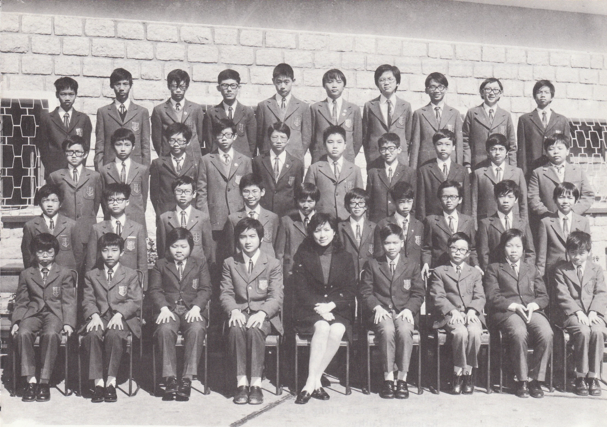

# Wah Yan Star 1976 - Page 127

## Extracted Photos & Figures



## Page Text Content

```text
1.
Chan Ka Yan
Chan Kwok Lai
3.
Chan Shu Ming
4.
Chan Wing Ling
5.
Cheng Chi Kin
6.
Cheng Siu Cheong, Bernard
7.
Cheung Shek Man, Francis
Chock Shuet Tsung
9.
Chow Chi Yee, Albert
10.
Fung Tak Wa
11. Jiu Ka Yui
12.
Koh Christopher James
13.
Lai Hon Wing
14.
Lam Chi Keung
15.
Lam Yin Bong
16.
Lau Stephen
17.
Lau Yu Hong
18.
Law Po Hung
19.
Lo Woon Man
20.
Mak Kong Choi
Miss Tam
FORM IBI （1975-76）
21. Ng Chi Keung
22.
Quck Erone
23.
Sham Wai
Shun, Peter
24. Shroft Sammy
鄭
25. Shum Wing Haye
26.
So Kwong Chu
張
卓
27.
Szeto Yuen King
28.
Tam Dick Sang
29.
Tsang' Byron
30.
Tsui Wai Hung, Bernard
招
31.
Wong Karine
32.
Wong
Kay Yip
黎
33.
Wong
Kung Bun, Carl
34.
Wong Michael
35.
Wong Tin Yu
劉
36.
Wong Wai Sing
37.
Woo Yiu Bo
38.
Wu Kim Hung，
Bosco
39.
Yeung Ka Ming
麥
江
40.
Yeung Ying Ip, Dominic
Absentee: 38, 8
吳志强
郭毅
龍
岑威
信
蘇寶：
鴻
岑榮禧
蘇廣鎭
司徒元勁
譚廸生
曾廣德
徐偉雄
黃家軒
黄基業
黃共斌
黃交甫
黃天雨
黃偉成
胡耀波
胡劍雄
楊嘉明
英
業
```
