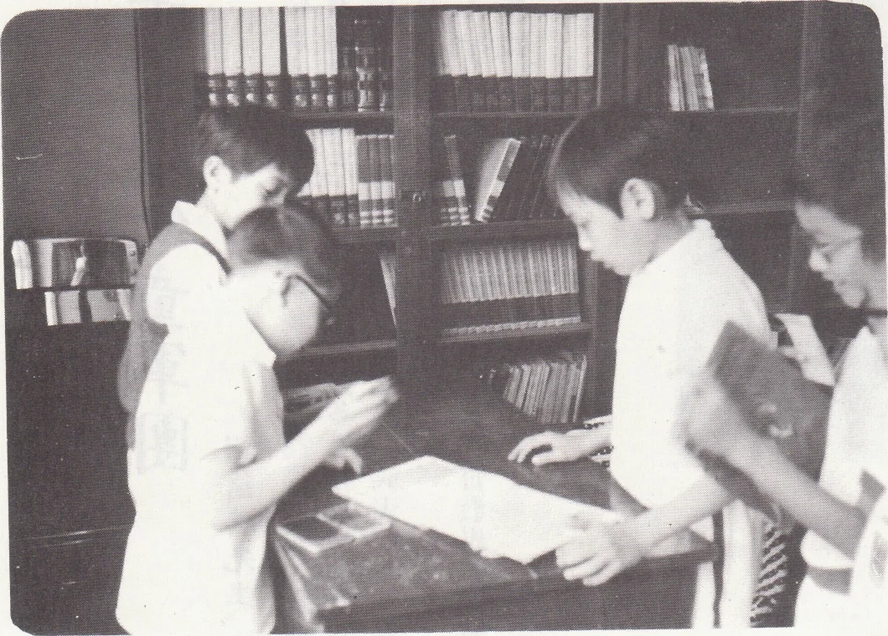
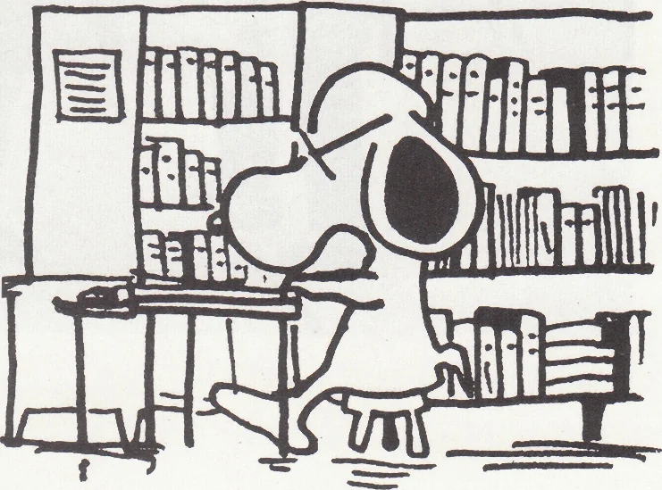

# Wah Yan Star 1976 - Page 134

## Extracted Photos & Figures




## Page Text Content

```text
SOOKS RETURN HERE
本校的圖書館設在第三層，與音樂室比鄰，圖
書館的地方寬敞，空氣流通，還設有桌及椅，以使
同學坐閱，在圖書館遠眺下去，可看見快活谷的美
躍風景，圖書館藏有豐富的書籍，種類繁多，林林
種種：不一而足，大致可分爲小說，民間故事，名
人故事以及名著等，分別放在七至八個櫃裏面，同
學們可任意選擇。
圖書館是由三位老師領導，並且由圖書管理員
分別負責借書、還書、秋序和排書等，他們分工合
作，使圖書館成爲吸取知識的好地方。
舅父給我一本新書，封耶得很美躍，書的
內容有故事、神話、歌謠和笑話等。我最得歡的還
是猜謎語那頁，有時自己貓中了，就驕傲起來，去
問弟弟妹妹，猜不中的就偷偷地去問爸爸。
以前在放學回家以後，我只跟弟弟妹妹爭着玩
具玩，把乒乓球，捉迷藏，甚至把衣服开辭了，皮
膚也弄損了。
現在，有了新書，我再不想嬉戲了，一回到家
裏，便拿着書來看，並把看過的故事講給弟弟妹妹
聽，大家一團和氣，媽媽看見了，便說我是一個好
孩子。
井井有條
```
