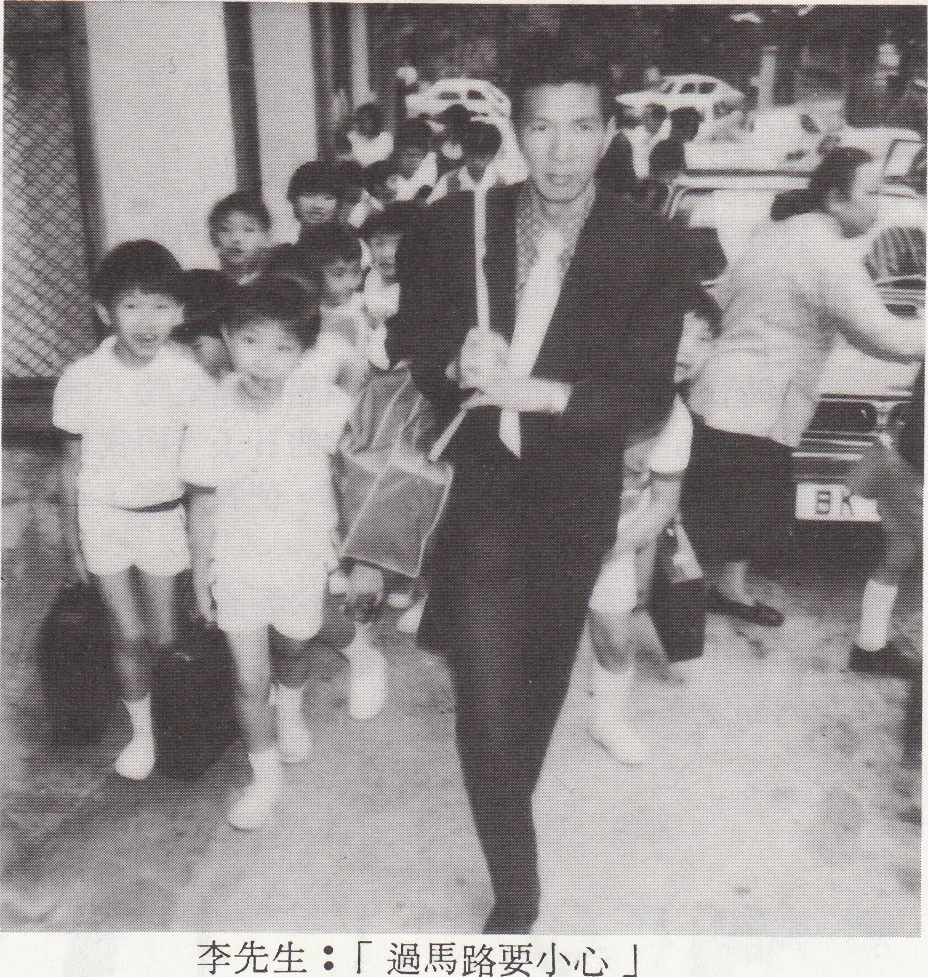
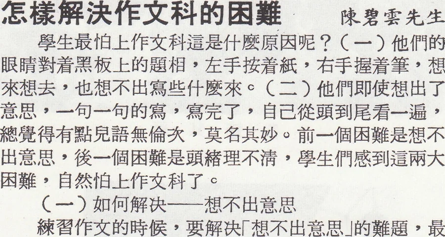
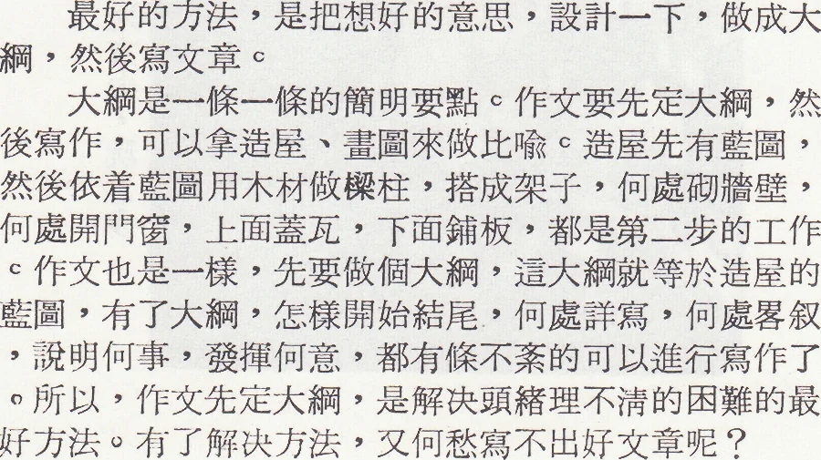

# Wah Yan Star 1976 - Page 139

## Extracted Photos & Figures





## Page Text Content

```text
心聲
李少華先生
教學已成為我的職業，這到底是我自己之選擇或「
命運 之安排，我不再去追究。
五年前番禺會所與華仁書院開始合辦本校，從此我
便成了該校之成員。
追隨校長連神父已多年了，在這五年間，無論在教
學上或待人處世上，我獲盆不少。他對工作認眞，每事
親力親為，和發憤忘食的精神，令我們產生一股强大的
勤奮衝勁。他愛護學生，但更愛護先生，他所給予我們
的，我們祇能用更勤力之工作抵償。
在此期間，我常任教升中會考班，所接觸的，都是
在驚濤駭浪，努力掙扎中的一羣，每當會考期間，身為
老師的我們，亦替同學分憂，我們會期待，更爲他們祈
禱，望他們衝破萬難，平步青雲，進升華仁書院，這些
精神之負荷，非筆墨所能形容。其後當知他們得到成功
，我們便會忘卻以往一切一切的辛勞，因爲我們所付出
的，是值得欣慰者。
小學教育工作十分艱鉅，我明白我要不斷進修，以
吸取外界日新月異的新知識。再者，雖然我們的年齡日
長不已，但我必須具備一顆青春常駐的心，因爲每天與
我們相處者，是一羣充滿活力，天眞無邪的小孩子，我
們應給予鼓勵、愛和温暖，使他們有了信賴，而有信心
努力學習。
所以為師者，不單是爲了爭取成績，還要培養學生
良好的品行，以及他們身心的健康。
凶＆EKLUUUE＆UUUU＆U U UU＆U K
爲甚麼學校課間要有小息？
怎樣活動比較合適？
馮聖康先生
學校裏每兩三課之間，都有十五分鐘的休息時間，
這是學校生活制度方面的一項合理的規定。在短短的休
息時間內，能使學生身體的肌肉消除疲勞，並能調和由
於長時間坐在一個地方不動所發生的不良影響。從生理
學的觀點來看，也是完全有必要的。
有些學生在十五分鐘小息的時候，都不肯放下書本
讓腦子休息一下，或是整天悶在教室裏讀書，這是不合
衛生的。這樣腦子長時間處於過度緊張狀態中。日子久
了，就會使腦子疲勞過度，嚴重時大腦皮層正常的神經
活動機能就會發生阻障，就會得神經衰弱症。
在課間十五分鐘最好的休息方法是活動性的休息。
在肌肉活動時，大腦皮層中一部分神經細胞興奮，而迫
使腦力工作時大腦皮層所興奮的神經細胞休息，這樣大
腦皮層中神經細胞的輪流活動，交替地得到休息。但課
間的活動不宜過於劇烈，因爲劇烈運動後立刻坐下來讀
書，一方面不合衛生，另一方面因為劇烈活動時，大腦
皮層的興奮區域產生對讀書時大腦皮層的興奮中心的抑
制作用，降低學習效率。因此課間十五分鐘以緩和的體
操、活動性的遊戲、操場上散步，或是自由活動較合適
。劇烈的跑跳運動、喧噪而情緒過於興奮的遊戲，都是
不適宜的。
李先生：「過馬路要小心」
SEKEKKKKKESKKKKKKUKELKKUUKUKLLUUUUKLLL&ULLwuu
久
怎樣解決作文科的困難
陳碧雲先生
學生最怕上作交科這是什麼原因呢？（一）他們的
眼睛對着黑板上的題相，左手按着紙，右手握着筆，想
來想去，也想不出寫些什麼來。（二）他們即使想出了
意思，一句一句的寫，寫完了，自己從頭到尾看一遍，
總覺得有點兒語無倫次，莫名其妙。前一個困難是想不
出意思，後一個困難是頭緒理不清，學生們感到這兩大
困難，自然怕上作文科了。
（一）如何解决—想不出意思
練習作文的時候，要解决「想不出意思」的難題，最
好的方法 是針對那個女題，可用下列三個原則來問問：
1.甚麼？
2.為什麼？
3.怎樣？
假定女題是「春遊」，我們先問：「什麼叫春遊？
」那回答的話，可以用來說明春遊的意義。次問：「爲
什麼要去春遊？」那回答的話，就可以說明春遊的好處
•双次間：「怎樣去春遊」那回答的話，可以用來說明
組織春季遠足隊的計劃或經過的情形等。
C二）如何解决——頭緒理不清
最好的方法，是把想好的意思，設計一下，做成大
綱，然後寫文章。
大綱是一條一條的簡明要點。作女要先定大綱，然
後寫作，可以拿造屋、畫圖來做比喻。造屋先有藍圖，
然後依着藍圖用木材做樑柱，搭成架子，何處牆壁，
何處開門窗，上面蓋瓦，下面鋪板，都是第二步的工作
•作交也是一樣，先要做個大綱，這大綱就等於造屋的
ZZRZZZR
藍圖，有了大綱，怎樣開始結尾，何處詳寫，何處畧叙
，說明何事，發揮何意，都有條不紊的可以進行寫作了
•所以，作交先定大綱，是解决頭緒理不清的困難的最
好方法。有了解决方法，又何愁寫不出好女章呢？
```
