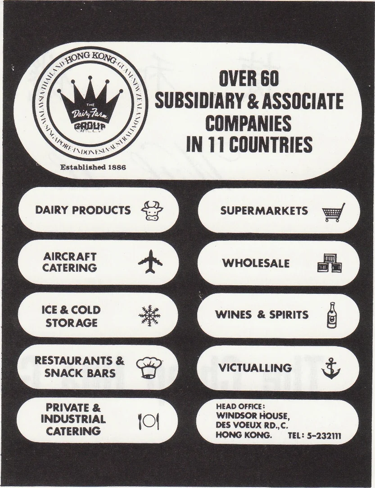

# Wah Yan Star 1976 - Page 148

## Extracted Photos & Figures



## Page Text Content

```text
With Compliments
A.S. Watson & Co. LTD.
Tais Tarn
GRBUP
Established 1886
DAIRY PRODUCTS
AIRCRAFT
CATERING
ICE & COLD
STORAGE
RESTAURANTS &
SNACK BARS
PRIVATE &
INDUSTRIAL
CATERING
OVER 60
SUBSIDIARY & ASSOCIATE
COMPANIES
IN 11 COUNTRIES
小
*
SUPERMARKETS
WHOLESALE
WINES & SPIRITS
VICTUALLING
HEAD OFFICE：
WINDSOR HOUSE，
DES VOEUX RD.，C.
TEL:5-232111
大地旅運社
GOOD EARTH TRAVEL SERVICE
24年歷史——信譽昭著
台
馬
泰
日本九洲團
代
大
專
業
地址：
心
谷地
策
廉
價
服
—233260•
型
運
輸
宜
厦
二樓120-124室
-233257•5-253776• 5—227871
```
