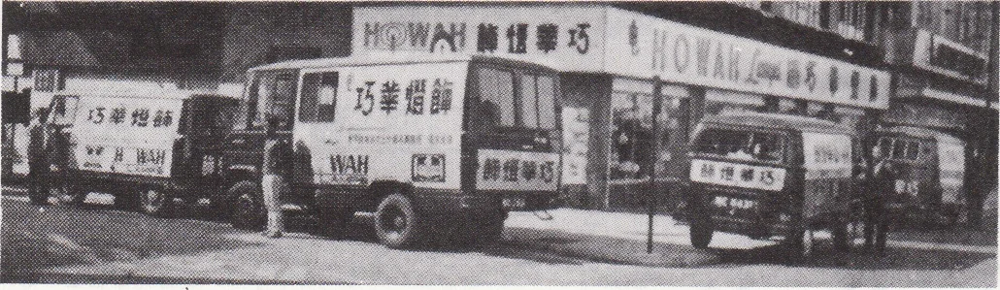

# Wah Yan Star 1976 - Page 149

## Extracted Photos & Figures



## Page Text Content

```text
Complimento of
TUNG FONG HAT FACTORY （HK） LTD.
Distinguished Hat Manufacturers since 1927
Head Office
： Aik San Factory Building, 7th foor，
14, Westlands Road, Quarry Bay
Hong Kong
Main Factory
121 How Ming Street, Kwun Tong
Kowloon
Branch Factory：
Cheung Wah Industrial Building
10th Hoor，
12 Shipyard Lane, Quarry Bay
Hong Kong
Telephone No.
： 5-635231
Telex
：83503 TFHAT HX
Cable Address ："CANELHATS”HONG KONG
*HOWA！
AMPS
1MPORTED
FROM OVER 60 MANUFACTURERS IN EUROPE，
U.S.A.
AND AUSTRALIA
WHOSE LIGHTING FIXTURES ARE
SOLELY DISTRIBUTED BY US.
巧
巧莱蟘腳
THE LARGEST LIGHTING CENTRE
IN SOUTHEAST ASIA
COMPRISING OVER 7000 DISTINCTIVE
AND UNIQUE SIYLES TO SUT EVERY
PURPOSE FOR LIGHTING AND DECOR.
巧華燈飾
HOWAH & CO.， LTD.
HONG KONG SHOWROOMS: 80-82 GLOUCESTER ROAD, G/F. & 2/F. WANCHAI.
KOWLOON SHOWROOMS: 26-32 HANKOW ROAD, BASEMENT, TSIMSHATSUI.
BUSINESS HOURS: 9:30 A.M. TO 6:30 P.M. SUNDAY CLOSED
```
